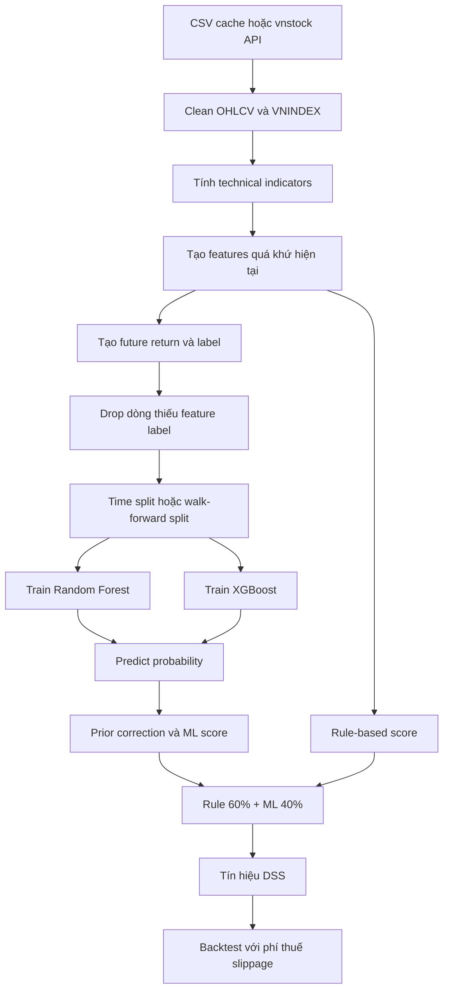

# DSS ML Handover Guide

Tài liệu này mô tả quy trình Machine Learning của DSS từ dữ liệu đầu vào đến tín
hiệu cuối cùng. Mục tiêu là giúp người tiếp nhận hiểu hệ thống đang làm gì, vì
sao từng bước tồn tại, cách chạy, cách đánh giá và các điểm cần cẩn thận khi
thay đổi.

## 1. Mục tiêu và phạm vi

DSS là hệ thống hỗ trợ phân tích cổ phiếu ngắn hạn trong rổ VN30. Hệ thống sử
dụng dữ liệu OHLCV theo ngày, chỉ báo kỹ thuật, dữ liệu VNINDEX và hai mô hình
phân loại:

- Random Forest.
- XGBoost.

Mỗi phiên của một mã được phân loại thành `SELL`, `HOLD` hoặc `BUY`. ML không
trực tiếp đặt lệnh. Kết quả ML được kết hợp với điểm rule-based để tạo điểm DSS
từ `0` đến `100`, sau đó chuyển thành tín hiệu `MUA MẠNH`, `MUA`, `GIỮ`, `BÁN`
hoặc `BÁN MẠNH`.

Đây là hệ thống nghiên cứu và hỗ trợ quyết định. Kết quả backtest không đảm bảo
lợi nhuận trong tương lai.

## 2. Toàn bộ luồng xử lý



| Phase | Nội dung | Source chính |
|---|---|---|
| 1 | Fetch và cache dữ liệu | `src/data/data_fetcher.py` |
| 2 | Clean dữ liệu | `src/data/data_cleaner.py` |
| 3 | Technical indicators | `src/features/indicators.py` |
| 4 | Feature engineering và label | `src/features/features.py` |
| 5 | Train và validation ML | `src/models/` |
| 6 | Rule score và ensemble decision | `src/scoring/` |
| 7 | Backtest | `src/backtest/backtester.py` |

## 3. Dữ liệu đầu vào

### 3.1. Dữ liệu cổ phiếu

Dữ liệu cổ phiếu được lưu tại `data/stocks/<SYMBOL>.csv` với các cột bắt buộc:

```text
time, open, high, low, close, volume
```

Mặc định hệ thống lấy khoảng 3 năm và tối đa khoảng 750 phiên. Dữ liệu mới được
append vào cache và khử trùng theo `time`.

### 3.2. Dữ liệu VNINDEX

File `data/index/VNINDEX.csv` được chuẩn hóa thành:

```text
time, indexValue
```

Các feature thị trường được merge vào từng mã cổ phiếu theo ngày.

### 3.3. Kiểm tra dữ liệu

`clean_ohlcv_data()` thực hiện:

1. Chuẩn hóa tên cột và kiểm tra schema OHLCV.
2. Chuyển thời gian sang datetime và sort tăng dần.
3. Chuyển OHLC, volume sang numeric.
4. Chỉ forward-fill dữ liệu có giá trị quá khứ.
5. Đánh dấu `volume_missing`, `is_extreme` và `is_ohlc_invalid`.

Không được dùng backward-fill cho giá vì giá trị tương lai có thể đi ngược về
quá khứ và tạo leakage.

## 4. Technical indicators

`calculate_technical_indicators()` thêm các nhóm chỉ báo:

| Nhóm | Chỉ báo |
|---|---|
| Trend | SMA 10/20/50/200, EMA 12/26 |
| MACD | MACD, signal, histogram |
| Momentum | RSI, Stochastic K/D, Williams %R |
| Volatility | Bollinger Bands, ATR, ATR% |
| Volume | OBV, volume SMA 20, volume ratio |

Các chỉ báo được tính tuần tự theo thời gian. Dòng đầu không đủ window sẽ có
NaN và bị loại khi xây tập train. `SMA_200` khiến dữ liệu thực tế cần khoảng
200 phiên trước khi có đầy đủ feature baseline.

## 5. Feature engineering

### 5.1. Baseline feature set

19 feature được train production hiện tại:

```text
price_vs_sma50, price_vs_sma200, sma50_vs_sma200
macd_hist, macd_hist_slope
rsi, stoch_k, stoch_d, williams_r
bb_position, bb_width, atr_pct
vol_ratio, obv_slope
return_1d, return_5d, return_20d
vnindex_vs_sma50, vnindex_return_5d
```

Các feature tương đối như `price_vs_sma50` giảm phụ thuộc vào mức giá tuyệt đối
giữa các mã khác nhau.

### 5.2. Extended feature set

Extended thêm:

```text
return_3d, return_10d, return_60d, rsi_slope
volume_zscore_20, vnindex_return_20d
vnindex_volatility_20d, relative_strength_5d
```

Extended được dùng trong lệnh evaluate khi chọn `--feature-set extended`. Model
production hiện dùng `FEATURE_COLUMNS` baseline, vì vậy phải cập nhật đồng bộ
train, predict, model cache và backtest nếu muốn đưa extended vào production.

### 5.3. Nguyên tắc leakage

Feature tại thời điểm `t` chỉ được phép dùng OHLCV, indicator và VNINDEX đến
thời điểm `t` hoặc thời điểm gần nhất trong quá khứ.

Không được đưa `future_return`, `label`, giá tương lai hoặc kết quả backtest vào
feature. Khi thêm feature mới, phải kiểm tra lại nguồn dữ liệu và hướng thời gian.

## 6. Label và supervised learning

Mỗi dòng tại thời điểm `t` là một mẫu. `X_t` gồm các feature quan sát được đến
`t`; `y_t` là kết quả tương lai dùng làm label. Model học quan hệ:

```text
X_t -> P(SELL), P(HOLD), P(BUY)
```

`future_return` chỉ dùng để tạo `y_t`, không được dùng làm `X_t`.

### 6.1. Fixed label

Với `forward_days = 5`:

```text
future_return[t] = close[t+5] / close[t] - 1
```

```text
future_return >= +(3% + chi phí vòng đi-về) -> BUY
future_return <= -(3% + chi phí vòng đi-về) -> SELL
còn lại                                      -> HOLD
```

Chi phí label hiện tại là `ML_LABEL_COST_RATE = 2 * fee + tax + 2 * slippage
= 0,6%`. Mục đích là tránh gọi một giao dịch gross +3% là thành công khi lợi
nhuận ròng sau chi phí không còn đạt mục tiêu.

### 6.2. Volatility label

```text
dynamic_threshold = max(3%, 1.5 * ATR% / 100) + chi phí vòng đi-về
```

Cổ phiếu biến động mạnh cần đạt mức lợi nhuận lớn hơn mới được gán BUY hoặc SELL.

### 6.3. Triple barrier label

Mỗi điểm vào có upper barrier, lower barrier và cửa sổ quan sát 5 phiên. Barrier
đầu tiên bị chạm quyết định label; nếu không chạm barrier nào thì HOLD. Nếu high
và low cùng chạm barrier trong cùng thời điểm mà không xác định được thứ tự trong
ngày, dùng chính sách bảo thủ và tránh giả định thứ tự.

### 6.4. Chọn label

Không chọn label chỉ dựa trên Macro F1. Cần xem đồng thời phân phối label,
BaselineHold, BaselineMomentum, precision BUY/SELL, độ ổn định qua mã/fold và
backtest sau chi phí.

Trong trạng thái hiện tại, `fixed` là label production vì dễ giải thích và
Ensemble vượt Momentum baseline tốt hơn về tín hiệu hành động. `volatility` và
`triple_barrier` là ứng viên nghiên cứu, chưa tự động thay thế production.

## 7. Chia dữ liệu theo thời gian

### 7.1. Vì sao không random shuffle

Dữ liệu tài chính là chuỗi thời gian. Random shuffle có thể đưa thông tin tương
lai vào train, làm metric cao giả tạo và không phản ánh cách model vận hành thật.
Mọi split phải giữ thứ tự thời gian.

### 7.2. Production holdout

`train_ml_models()` dùng 80% đầu để train và 20% cuối để test theo thứ tự thời
gian. Không shuffle.

### 7.3. Walk-forward validation

`walk_forward_validate()` dùng:

```text
initial train: 50% usable rows
validation mỗi fold: 10%
purge gap: 5 phiên
```

```text
[train 50%] [gap 5] [validation 10%]
[train 60%] [gap 5] [validation 10%]
[train 70%] [gap 5] [validation 10%]
```

Train set mở rộng dần và validation luôn nằm sau train. Purge gap loại bỏ các
mẫu sát ranh giới có label còn nhìn vào vùng validation.

## 8. Baseline trước khi đánh giá model

Một model chỉ có ý nghĩa khi vượt được chiến lược đơn giản.

### 8.1. BaselineHold

Luôn dự đoán HOLD. Baseline này cho biết accuracy có thể đạt chỉ bằng cách chọn
class phổ biến nhất. Nó không tạo tín hiệu hành động.

### 8.2. BaselineMomentum

```text
return_5d >= +1% -> BUY
return_5d <= -1% -> SELL
còn lại           -> HOLD
```

Đây là baseline gần với một quy tắc giao dịch thực tế hơn BaselineHold. Ensemble
cần vượt baseline này trên nhiều mã và nhiều fold.

## 9. Mô hình ML

### 9.1. Random Forest

Random Forest là ensemble của nhiều decision tree độc lập. Mỗi tree học trên một
mẫu bootstrap và một phần feature, sau đó kết quả được tổng hợp.

Ưu điểm là bắt quan hệ phi tuyến, ít nhạy với scale và có class balancing. Hạn
chế là xác suất chưa chắc đã calibrated và tree quá sâu có thể học nhiễu.

Cấu hình hiện tại:

```python
{
    "n_estimators": 200,
    "max_depth": 10,
    "min_samples_leaf": 20,
    "class_weight": "balanced",
    "random_state": 42,
}
```

### 9.2. XGBoost

XGBoost xây các tree tuần tự; tree sau sửa lỗi của tree trước. Learning rate,
depth và subsampling kiểm soát mức overfit.

Cấu hình hiện tại:

```python
{
    "n_estimators": 300,
    "max_depth": 6,
    "learning_rate": 0.05,
    "subsample": 0.8,
    "colsample_bytree": 0.8,
    "eval_metric": "mlogloss",
    "random_state": 42,
}
```

XGBoost mạnh trên dữ liệu bảng nhưng nhạy với hyperparameter và dễ overfit dữ
liệu tài chính nhiễu.

### 9.3. Class imbalance

HOLD thường chiếm nhiều hơn BUY và SELL. RF dùng `class_weight="balanced"`,
XGBoost dùng `sample_weight`, validation báo cáo metric riêng cho từng class và
BaselineHold được tính để phát hiện accuracy giả.

Nếu training window thiếu class, model được bỏ qua an toàn và ML score trở về
neutral thay vì crash hoặc tạo model không đầy đủ.

## 10. Training và xác suất

Các dòng thiếu feature hoặc label bị loại. Model cần tối thiểu
`MIN_TRAIN_ROWS = 100` dòng usable.

RF và XGBoost trả về `P(SELL), P(HOLD), P(BUY)`. Production lấy trung bình:

```text
P_ensemble = (P_RF + P_XGB) / 2
ML score = P(BUY) sau prior correction * 100
```

Do train có class balancing, prior của train được lưu vào model và dùng để hiệu
chỉnh xác suất trước khi lấy xác suất BUY. Nếu thiếu model hoặc feature hiện tại
có NaN, ML score mặc định là `50`. Đây là score phục vụ decision, không phải xác
suất lợi nhuận đã calibration đầy đủ.

## 11. Rule score và decision

Rule-based score bắt đầu từ `50` và cộng/trừ theo trend, SMA, golden/death
cross, MACD, RSI, Stochastic, volume, OBV, Bollinger Bands, ATR và VNINDEX.
Điểm được clip trong khoảng `0` đến `100`.

```text
total_score = rule_score * 0.60 + ml_score * 0.40
```

| Total score | Tín hiệu |
|---:|---|
| `>= 75` | MUA MẠNH |
| `60 - 74.99` | MUA |
| `40 - 59.99` | GIỮ |
| `25 - 39.99` | BÁN |
| `< 25` | BÁN MẠNH |

Rule score và ML score có thể bất đồng. Khi đó total score thường kéo về vùng
trung tính; cần xem cả hai thành phần trong output.

## 12. Validation metrics

### 12.1. Accuracy

```text
accuracy = số dự đoán đúng / tổng số mẫu
```

Chỉ dùng để tham khảo vì bị chi phối bởi class HOLD.

### 12.2. Precision và recall

```text
precision = TP / (TP + FP)
recall    = TP / (TP + FN)
```

BUY precision trả lời: trong các lần model báo BUY, bao nhiêu lần đúng BUY.
BUY recall trả lời: trong các cơ hội BUY thực tế, model bắt được bao nhiêu.
SELL có cách đọc tương tự.

### 12.3. F1 và balanced accuracy

```text
F1 = 2 * precision * recall / (precision + recall)
```

Macro F1 là trung bình F1 của SELL, HOLD và BUY. Balanced accuracy là trung bình
recall của các class. Mức balanced accuracy khoảng `0,333` trong bài toán 3
class thường gần mức ngẫu nhiên.

## 13. Backtest

Backtest nằm ở `src/backtest/backtester.py` và hiện thực:

1. Duyệt cửa sổ 6 tháng cuối.
2. Model chỉ train bằng dữ liệu quá khứ.
3. Retrain mỗi 20 phiên.
4. Tín hiệu sinh tại close ngày `i`.
5. Lệnh khớp tại open ngày `i+1`.
6. Thoát tại T+5 hoặc khi total score xuống dưới ngưỡng SELL.
7. Tính phí mua, phí bán, thuế bán và slippage.

Chi phí cấu hình:

```text
fee      = 0,15% mỗi chiều
tax      = 0,10% khi bán
slippage = 0,10% mỗi chiều
```

Buy & Hold cũng được tính với chi phí để so sánh công bằng hơn.

Metric chính:

- `dss_return`: lợi nhuận cuối kỳ của DSS.
- `buy_hold_return`: lợi nhuận mua và giữ.
- `vnindex_return`: biến động VNINDEX.
- `win_rate`: tỷ lệ lệnh thắng.
- `profit_factor`: tổng lãi chia tổng lỗ tuyệt đối.
- `sharpe`: lợi nhuận điều chỉnh theo biến động, annualized theo 252 phiên.
- `max_drawdown`: mức giảm lớn nhất từ đỉnh equity.
- `exposure`: tỷ lệ thời gian đang giữ vị thế.

Không kết luận model tốt nếu chỉ nhìn một mã, một giai đoạn hoặc một trade có
lợi nhuận rất lớn.

## 14. Cấu trúc report

| File | Mục đích |
|---|---|
| `label_distribution.csv` | Phân phối label và số dòng trainable |
| `walk_forward_metrics.csv` | Metric phân loại theo fold và aggregate |
| `confusion_matrix.csv` | Chi tiết actual/predicted theo class |
| `backtest_symbols.csv` | Hiệu quả tổng hợp theo mã |
| `backtest_trades.csv` | Chi tiết từng giao dịch |
| `tuning_results.csv` | So sánh candidate hyperparameter |

Chi tiết schema nằm trong [REPORT_METRICS.md](REPORT_METRICS.md).

## 15. Quy trình vận hành

```bash
# Cài môi trường
./run.sh setup

# Cập nhật dữ liệu
./run.sh fetch

# Chạy khuyến nghị offline
./run.sh dss --no-fetch --symbols FPT,ACB

# Train lại model
./run.sh dss --no-fetch --symbols FPT,ACB --retrain

# Test
python3 -m unittest discover -s tests -v
./run.sh test

# Đánh giá label/model
./run.sh evaluate --label-strategy fixed --feature-set baseline
./run.sh evaluate --label-strategy volatility --feature-set baseline
./run.sh evaluate --label-strategy triple_barrier --feature-set baseline

# Backtest
./run.sh backtest --months 6 --retrain-every 20
```

## 16. Khi thay đổi hệ thống

### Thay đổi label

Phải chạy lại label distribution, BaselineHold, BaselineMomentum, RF/XGB/Ensemble
walk-forward và backtest cùng phí. Không thay label rồi giữ nguyên kết luận của
model cũ.

### Thay đổi feature

Phải kiểm tra feature chỉ dùng quá khứ, không tạo NaN ngoài dự kiến, được dùng
giống nhau ở train và predict, không dùng nhầm model cache cũ và có vượt baseline.

### Thay đổi model

Phải ghi lại hyperparameter, random seed, feature set, label strategy, khoảng
thời gian dữ liệu, kết quả từng fold và backtest sau chi phí. Không chọn model chỉ
vì accuracy cao hoặc vì một mã có kết quả nổi bật.

## 17. Checklist bàn giao

- [ ] `python3 -m unittest discover -s tests -v` đạt.
- [ ] `python3 -m compileall -q .` đạt.
- [ ] `bash -n run.sh` đạt.
- [ ] Smoke test offline đạt.
- [ ] Dữ liệu đúng thời gian và không trùng phiên.
- [ ] Label distribution không lệch bất thường.
- [ ] Model được so sánh với baseline trên nhiều fold và nhiều mã.
- [ ] Backtest có phí, thuế và slippage.
- [ ] Report ghi rõ label, feature set và thời gian đánh giá.
- [ ] Không có leakage từ `future_return`, `label` hoặc dữ liệu tương lai.
- [ ] Model artifact và source code dùng cùng feature schema.
- [ ] Thay đổi đã được ghi vào Git.

## 18. Giới hạn hiện tại

Hệ thống chỉ dùng OHLCV và VNINDEX. Chưa có tin tức, sentiment, báo cáo tài
chính, position sizing theo rủi ro, portfolio backtest nhiều mã cùng lúc,
probability calibration đầy đủ hoặc kiểm tra regime đủ dài qua nhiều chu kỳ.

Kết quả nên được dùng làm baseline nghiên cứu. Bất kỳ thay đổi nào nhằm cải thiện
Macro F1 vẫn phải được xác nhận bằng backtest net return, drawdown, turnover và
độ ổn định qua nhiều giai đoạn.

## 19. Source of truth

Khi tài liệu khác với code, ưu tiên kiểm tra theo thứ tự:

1. `config.py` cho tham số.
2. `src/features/features.py` cho label và feature.
3. `src/models/ml_models.py` cho production training/predict.
4. `src/models/validation.py` cho walk-forward và baseline.
5. `src/backtest/backtester.py` cho execution và chi phí.
6. `REPORT_METRICS.md` cho schema report.

Các file report chỉ là snapshot của một lần chạy, không phải nguồn định nghĩa
logic.
