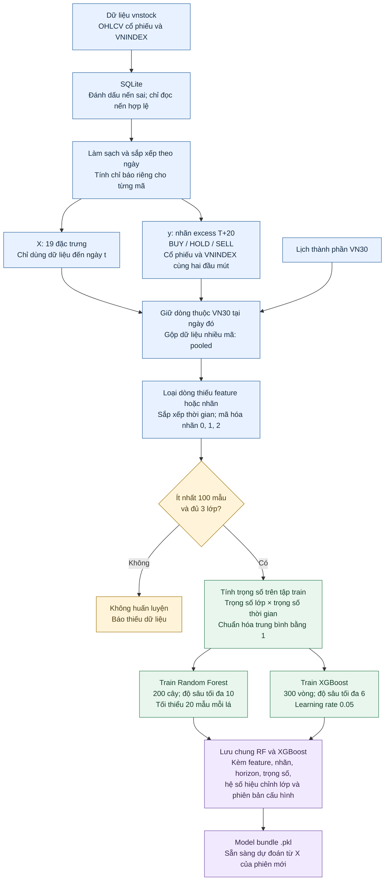
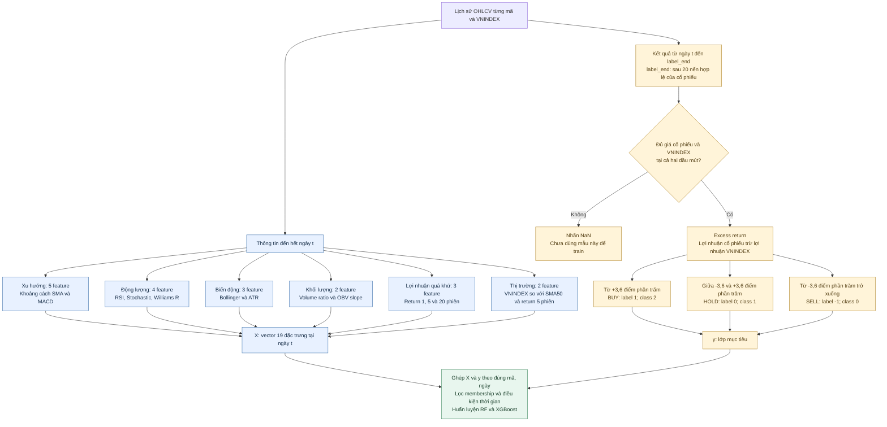
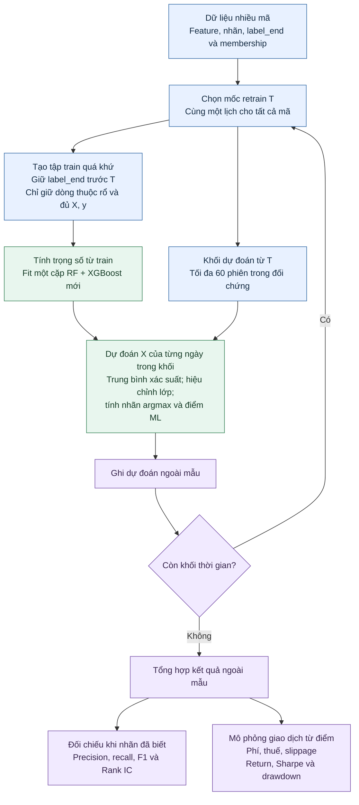

**Sơ đồ xử lý và huấn luyện ML của DSS VN30**

Phạm vi: nhánh website pooled, nhãn excess T+20, 19 feature baseline.
Sơ đồ đầu mô tả một lần tạo mới hoặc huấn luyện lại model. Khi cache model
còn phù hợp với dữ liệu và cấu hình, website nạp lại model và bỏ qua bước fit.

**Từ dữ liệu đến model đã huấn luyện**



Feature và chỉ báo được tính riêng theo từng mã **trước khi gộp**. Nếu gộp
rồi tính rolling/shift chung, dữ liệu của mã này có thể lẫn sang mã khác.

X và y là hai thành phần khác nhau: `future_return`, `label` và `label_end`
không được đưa vào 19 feature. Một phiên mới chưa có nhãn T+20 vẫn có thể được
dự đoán nếu đã đủ X; nó chưa đủ điều kiện đưa vào train có giám sát.

Nhãn excess dùng chênh lệch lợi nhuận cổ phiếu và VNINDEX: BUY khi chênh lệch
ít nhất +3,6 điểm phần trăm; SELL khi không quá −3,6 điểm phần trăm; HOLD ở
giữa. T+20 là 20 nến hợp lệ tiếp theo của cổ phiếu, không phải 20 ngày lịch.
Thiếu giá VNINDEX ở một đầu mút thì không tạo nhãn cho dòng đó.

RF và XGBoost nhận cùng X, y và dãy trọng số mẫu. Hai nhánh trong sơ đồ biểu
diễn hai model riêng; hàm `fit_models` hiện gọi fit RF rồi fit XGBoost theo
thứ tự, không chạy hai lời gọi fit đồng thời.

**Chi tiết hai nhánh: feature X và nhãn y**



Các nhánh BUY/HOLD/SELL là ba điều kiện loại trừ nhau; mỗi mẫu đủ dữ liệu chỉ
nhận một nhãn. Phần tương lai đi vào y, tuyệt đối không được nối vào X.

**Danh sách đầy đủ 19 feature đang đưa vào model**

Ký hiệu: `C` là giá đóng cửa cổ phiếu; `I` là VNINDEX; `V` là volume;
`U`, `L`, `M` là dải trên, dải dưới, đường giữa Bollinger. Công thức tỷ lệ
trong bảng lược bỏ epsilon `1e-9` chống chia cho 0 trong code. SMA dùng trung
bình trượt; EMA dùng trung bình có trọng số mũ. Các cửa sổ được tính trên
chuỗi nến hợp lệ đã sắp xếp của từng mã hoặc của VNINDEX tương ứng.

| STT | Feature | Công thức / cách tạo | Ý nghĩa |
|---:|---|---|---|
| 1 | `price_vs_sma50` | `100 × (C − SMA50) / SMA50` | Giá cao/thấp hơn xu hướng 50 phiên bao nhiêu % |
| 2 | `price_vs_sma200` | `100 × (C − SMA200) / SMA200` | Vị trí giá so với xu hướng dài hạn |
| 3 | `sma50_vs_sma200` | `100 × (SMA50 − SMA200) / SMA200` | Chênh lệch xu hướng trung hạn và dài hạn |
| 4 | `macd_hist` | `MACD − Signal`; MACD = EMA12 − EMA26; Signal = EMA9 của MACD | Độ lệch MACD so với đường tín hiệu; còn theo đơn vị giá |
| 5 | `macd_hist_slope` | `macd_hist[t] − macd_hist[t−3]` | Thay đổi histogram sau 3 phiên; chưa chia cho 3 |
| 6 | `rsi` | RSI cửa sổ 14 phiên | Tương quan sức tăng/giảm gần đây, thang 0–100 |
| 7 | `stoch_k` | `100 × (C − Low14) / (High14 − Low14)` | Giá đóng cửa nằm ở đâu trong biên cao/thấp 14 phiên |
| 8 | `stoch_d` | SMA3 của `stoch_k` | Đường làm mượt Stochastic K |
| 9 | `williams_r` | `−100 × (High14 − C) / (High14 − Low14)` | Vị trí giá trong biên 14 phiên, thang −100 đến 0 |
| 10 | `bb_position` | `(C − L) / (U − L)` | Vị trí trong Bollinger: 0 ở dải dưới, 1 ở dải trên; có thể vượt ngoài khoảng này |
| 11 | `bb_width` | `(U − L) / M` | Độ rộng tương đối của Bollinger; là tỷ lệ, chưa nhân 100 |
| 12 | `atr_pct` | `100 × ATR14 / C` | Biên độ biến động ATR so với giá |
| 13 | `vol_ratio` | `V / SMA20(V)` | Khối lượng hiện tại gấp bao nhiêu lần trung bình 20 phiên |
| 14 | `obv_slope` | `(OBV[t] − OBV[t−5]) / abs(OBV[t−5])` | Thay đổi tương đối của OBV trong 5 phiên |
| 15 | `return_1d` | `100 × (C[t] / C[t−1] − 1)` | Lợi nhuận quá khứ 1 phiên |
| 16 | `return_5d` | `100 × (C[t] / C[t−5] − 1)` | Lợi nhuận quá khứ 5 phiên |
| 17 | `return_20d` | `100 × (C[t] / C[t−20] − 1)` | Lợi nhuận quá khứ 20 phiên |
| 18 | `vnindex_vs_sma50` | `100 × (I − SMA50(I)) / SMA50(I)` | Trạng thái VNINDEX so với xu hướng 50 phiên |
| 19 | `vnindex_return_5d` | `100 × (I[t] / I[t−5] − 1)` | Động lượng thị trường trong 5 phiên vừa qua |

`High14` là giá high lớn nhất và `Low14` là giá low nhỏ nhất trong cửa sổ 14
nến, tính cả ngày t. Bollinger dùng cửa sổ 20 và biên ±2 độ lệch chuẩn. OBV
là chỉ báo tích lũy khối lượng theo chiều biến động giá đóng cửa.

`return_20d` nhìn về quá khứ, còn `future_return` nhìn về tương lai. Chúng có
hướng thời gian trái nhau dù cùng dùng số 20. Nhầm hai cột này sẽ gây rò rỉ
dữ liệu.

Các cột như `sma_50`, `sma_200`, `macd`, `atr`, `obv` là chỉ báo trung gian;
model baseline nhận các feature được chọn trong bảng. `golden_cross` và
`death_cross` phục vụ luật kỹ thuật, không thuộc 19 đầu vào ML. Bộ `extended`
có thêm feature trong code nhưng không phải bộ đang dùng cho website này.

**Công thức nhãn và cách mã hóa**

Gọi `e = label_end` là ngày sau 20 nến hợp lệ của cổ phiếu tính từ ngày t:

```text
future_return         = Close[e] / Close[t] − 1
vnindex_future_return = VNINDEX[e] / VNINDEX[t] − 1
excess_return         = future_return − vnindex_future_return
threshold             = 0.03 + 0.006 = 0.036
```

| Điều kiện | Nhãn | Giá trị `label` | Giá trị y truyền vào model |
|---|---|---:|---:|
| `excess_return >= 0.036` | BUY | 1 | 2 |
| `−0.036 < excess_return < 0.036` | HOLD | 0 | 1 |
| `excess_return <= −0.036` | SELL | −1 | 0 |
| Thiếu một đầu mút giá cần thiết | Chưa xác định | NaN | Loại khỏi train |

Ví dụ minh họa giả định: cổ phiếu tăng từ 100 lên 108 và VNINDEX tăng từ
1.000 lên 1.030 trong cùng khoảng ngày. Lợi nhuận tương ứng 8% và 3%, chênh
lệch 5 điểm phần trăm, nên mẫu ngày t được gán BUY. Nếu cổ phiếu giảm 2% còn
VNINDEX giảm 8%, nhãn vẫn là BUY vì mức vượt chỉ số là 6 điểm phần trăm.

Nhãn BUY vì vậy mô tả hiệu suất tương đối. Ngưỡng 3,6 điểm phần trăm là tham
số của cách tạo nhãn, không phải xác suất thắng hay ngưỡng điểm mua 60.

SMA200 khiến phần đầu chuỗi chưa đủ X; 20 nến cuối chưa có y T+20. Khi thiếu
VNINDEX tại một đầu mút, y cũng là NaN và không được điền bằng HOLD. Các
feature VNINDEX hiện được forward-fill khi thiếu sau phép ghép ngày; giá
VNINDEX dùng tính nhãn được tra đúng hai đầu mút, không forward-fill.

**Huấn luyện và kiểm chứng theo thời gian trong đối chứng vừa chạy**



Điều kiện `label_end < T` loại những mẫu có ngày bắt đầu trong quá khứ nhưng
kết quả T+20 chưa thể biết tại mốc train. Lấy mẫu ngẫu nhiên trong RF/XGBoost
chỉ diễn ra sau khi tập train đã được giới hạn đúng thời gian.

Trong đối chứng: retrain mỗi 60 phiên, `save=False`, không ghi đè bundle dùng
cho website. Khối cuối có thể chưa đủ 60 phiên hoặc chưa có nhãn trưởng thành;
chỉ những dự đoán đã có nhãn hợp lệ mới được tính metric phân loại.

Đây là luồng kiểm chứng riêng, không phải bước tự động chạy mỗi khi website
train. Lệnh `evaluate` cũng là một luồng riêng: mặc định train ban đầu khoảng
50% số ngày usable, validation mỗi khối khoảng 10%, có purge và nhận khối cuối.
`evaluate` hiện đo argmax trước hiệu chỉnh lớp; đối chứng điểm giao dịch đo
đầu ra sau hiệu chỉnh. Vì vậy không ghép hai báo cáo như cùng một metric.

**Từ model đến điểm sử dụng**


| Thiết lập | Website | Đối chứng đã chạy |
|---|---|---|
| Phạm vi học | Pooled, lịch sử VN30 | Pooled, lịch sử VN30 |
| Nhãn / feature | Excess T+20 / 19 feature | Giống website |
| Balancing | Bật | Có hoặc không |
| Trọng số thời gian | Bằng nhau | Bằng nhau hoặc half-life 730,5 ngày |
| Lưu model | Bundle dùng cho dự đoán | Không lưu đè bundle website |
| Kiểm chứng lịch sử | Luồng riêng | Walk-forward, retrain mỗi 60 phiên |

Các tệp hiện thực chính:

- `backend/src/pipeline.py`: nạp dữ liệu, clean, indicators, features và labels.
- `backend/src/features/features.py`: xây X, y và ngày kết thúc nhãn.
- `backend/api/features/market.py`: chọn lịch sử thành phần rổ, gộp train và cache website.
- `backend/src/models/ml_models.py`: kiểm tra train, tính trọng số, fit, lưu và dự đoán.
- `backend/src/models/validation.py`: walk-forward cho lệnh evaluate.
- `backend/src/backtest/backtester.py`: purge và dự đoán từng khối trong backtest.
- `backend/weighting_experiment.py`: đối chứng bốn cấu hình trọng số.
