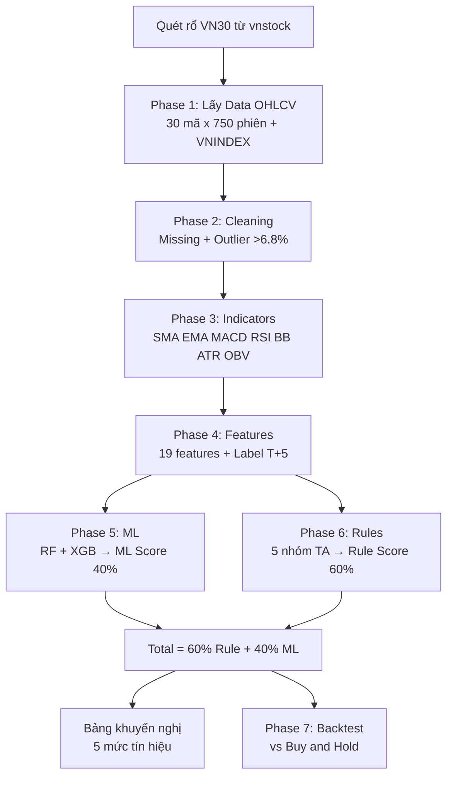
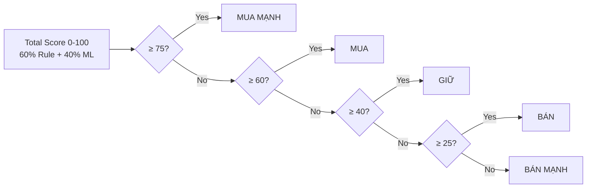
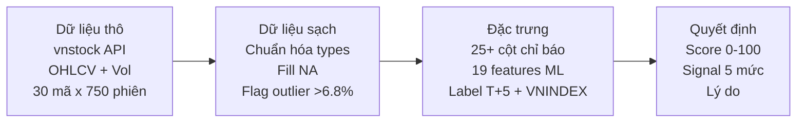
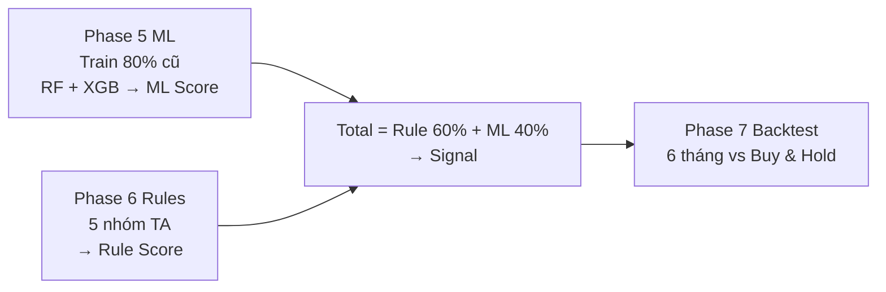

# 📈 DSS — Hệ thống Hỗ trợ Quyết định Mua Bán Cổ Phiếu (VN30)

## Mục lục

- [1. Mô tả Bài toán](#1-mô-tả-bài-toán) — Hệ thống này giải quyết gì?
- [2. Demo nhanh](#2-demo-nhanh--output-mẫu) — Kết quả trông thế nào?
- [3. Cài đặt & Chạy](#3-cài-đặt--chạy) — Chạy thử trong 3 lệnh
- [4. Kiến trúc Hệ thống](#4-kiến-trúc-hệ-thống) — Bức tranh toàn cảnh 7 phase
- [5. Luồng Xử lý Dữ liệu](#5-luồng-xử-lý-dữ-liệu-data-processing-pipeline) — Đi sâu từng bước
- [6. Cấu trúc Dự án](#6-cấu-trúc-dự-án) — Code nằm ở đâu?
- [7. Cấu hình](#7-cấu-hình-configpy) — Tinh chỉnh tham số
- [8. Hệ thống Labels](#8-hệ-thống-labels--nhãn-dữ-liệu) — Hiểu điểm số
- [9. Phân tích Thuật toán](#9-phân-tích-thuật-toán) — Hiểu vì sao lại chấm thế
- [10. Tài liệu Chi tiết](#10-tài-liệu-chi-tiết) — Đọc tiếp ở đâu?
- [⚠️ Disclaimer & Hạn chế](#️-disclaimer)

> Sơ đồ Mermaid chi tiết 7 phase xem tại [implementation_plan.md](implementation_plan.md) — đây là nguồn duy nhất (single source) cho kiến trúc.

## 1. Mô tả Bài toán

### 1.1. Bối cảnh

Thị trường chứng khoán Việt Nam (HOSE) có hơn 1.500 mã cổ phiếu niêm yết, với hàng triệu phiên giao dịch mỗi ngày. Nhà đầu tư cá nhân thường đối mặt với các khó khăn:

- **Quá tải thông tin:** Hàng chục chỉ báo kỹ thuật (RSI, MACD, Bollinger Bands...) cần phân tích đồng thời cho mỗi mã cổ phiếu.
- **Thiếu nhất quán:** Quyết định mua/bán dựa trên cảm tính, bị chi phối bởi tâm lý (tham lam khi thị trường tăng, sợ hãi khi thị trường giảm).
- **Thiếu công cụ tổng hợp:** Các nền tảng hiện tại chỉ cung cấp chỉ báo riêng lẻ, thiếu một hệ thống **tự động tổng hợp** và **chấm điểm** để đưa ra khuyến nghị cụ thể.

### 1.2. Mục tiêu Đề tài

Xây dựng **Hệ thống Hỗ trợ Quyết định (Decision Support System — DSS)** kết hợp Phân tích Kỹ thuật (Technical Analysis) và Học máy (Machine Learning) nhằm:

1. **Tự động thu thập** dữ liệu giá cổ phiếu rổ VN30 từ API `vnstock`.
2. **Tính toán** 20+ chỉ báo kỹ thuật (mở rộng thành 25+ cột) rồi chắt lọc thành **19 features** cho mô hình ML.
3. **Huấn luyện** mô hình phân loại (Random Forest + XGBoost) để dự đoán xu hướng ngắn hạn (T+5).
4. **Kết hợp** điểm số từ quy tắc chuyên gia (60%) và Machine Learning (40%) để đưa ra tín hiệu giao dịch: **MUA MẠNH / MUA / GIỮ / BÁN / BÁN MẠNH**.
5. **Kiểm chứng** hiệu suất bằng module Backtest, so sánh lợi nhuận với chiến lược Mua & Giữ (Buy & Hold).

### 1.3. Phạm vi Giới hạn (Scope)

| Tiêu chí | Giới hạn | Lý do |
|----------|----------|-------|
| **Dữ liệu** | Chỉ 30 mã thuộc rổ **VN30** | Vốn hóa lớn, thanh khoản cao, ít bị thao túng → Phân tích kỹ thuật & ML chính xác hơn |
| **Thời gian giao dịch** | Ngắn hạn **T+5** (5 phiên) | Phù hợp swing trading, quy tắc T+2 trên HOSE |
| **Phương pháp** | Phân tích kỹ thuật + ML | Không bao gồm Phân tích cơ bản (BCTC, P/E) hoặc Phân tích tâm lý (tin tức) |
| **Dữ liệu lịch sử** | 3 năm (~750 phiên/mã) | Đủ dài để ML học pattern, đủ ngắn để không bị lỗi thời |
| **Đầu ra** | Tín hiệu + Điểm số + Lý do | Hệ thống *hỗ trợ* quyết định, không phải bot giao dịch tự động |

---

## 2. Demo nhanh — Output mẫu

> Đọc 30 giây để biết hệ thống trả về gì, rồi mới quyết định đọc tiếp hay chạy thử ở §3.

Khớp với `src/decision.py: print_terminal_report` — 7 cột: MÃ | GIÁ | TỔNG | RULES (60%) | ML (40%) | KHUYẾN NGHỊ | LÝ DO.
Terminal dùng `tabulate fancy_grid`, dưới đây là bản markdown gọn để đọc trên GitHub:

| MÃ | GIÁ | TỔNG | RULES (60%) | ML (40%) | KHUYẾN NGHỊ | LÝ DO |
|---|---|---|---|---|---|---|
| FPT | 72,200 đ | 72.0 | 71.0 | 73.5 | 🟡 MUA | RSI phục hồi; MACD tích cực |
| TCB | 48,600 đ | 51.0 | 50.0 | 52.5 | ⚪ GIỮ | Sideway, chờ breakout |
| HPG | 26,100 đ | 32.0 | 22.0 | 47.0 | 🟠 BÁN | Death cross; volume giảm |

> Tổng điểm = 60% Rules + 40% ML Ensemble (RF + XGBoost).

---

## 3. Cài đặt & Chạy

> Thấy output ở §2 rồi? Chạy thật chỉ cần 3 lệnh. Hiểu bên trong thì đọc tiếp §4–§5 sau.

### Cách 1: Dùng `run.sh` (Khuyến nghị)

```bash
# Lần đầu: setup môi trường + cài thư viện
./run.sh setup

# Tải data VN30
./run.sh fetch

# Chạy khuyến nghị hôm nay
./run.sh dss

# Chạy backtest 6 tháng
./run.sh backtest

# Kiểm tra trạng thái dự án
./run.sh status

# Xem tất cả lệnh
./run.sh help
```

### Cách 2: Chạy thủ công

```bash
# 1. Cài thư viện
pip install -r requirements.txt

# 2. Tải dữ liệu VN30
python src/data_fetcher.py

# 3. Chạy khuyến nghị
python main.py

# 4. Chạy backtest
python backtest_runner.py
```

---

## 4. Kiến trúc Hệ thống

> Bức tranh toàn cảnh trước, chi tiết từng bước xem ở §5. Bản Mermaid chuẩn 7 phase nằm ở [implementation_plan.md §1](implementation_plan.md#1-kiến-trúc-tổng-quan-toàn-hệ-thống). Sơ đồ dưới đây là bản rút gọn để đọc nhanh.



### Thuật toán Machine Learning

| Thuật toán | Vai trò | Cơ chế |
|-----------|---------|--------|
| **Random Forest** | "Phòng thủ" — Ổn định, chống nhiễu | 200 cây quyết định song song (Bagging), bỏ phiếu đa số |
| **XGBoost** | "Tấn công" — Nhạy bén, bắt pattern tinh vi | 300 cây tuần tự (Boosting), mỗi cây sửa lỗi cây trước |
| **Ensemble** | Trung bình xác suất 2 model | `ML Score = P(MUA) × 100` |
| **Rule-Based** | "Trọng tài" — Kiểm tra logic TA cơ bản | Chấm điểm 5 nhóm: Trend 30%, Momentum 25%, Volume 20%, Volatility 15%, Market 10% |

### Tín hiệu đầu ra

| Signal | Điểm | Ý nghĩa |
|--------|------|---------|
| 🟢 **MUA MẠNH** | ≥ 75 | Cả ML và Rules đều tích cực mạnh |
| 🟡 **MUA** | 60–74 | Phần lớn chỉ báo tích cực |
| ⚪ **GIỮ** | 40–59 | Tín hiệu trái chiều, chưa rõ xu hướng |
| 🟠 **BÁN** | 25–39 | Phần lớn chỉ báo tiêu cực |
| 🔴 **BÁN MẠNH** | < 25 | Cả ML và Rules đều cảnh báo rủi ro |



---

## 5. Luồng Xử lý Dữ liệu (Data Processing Pipeline)

> Đã có big picture ở §4, giờ đi sâu từng phase làm gì với dữ liệu.

### 5.1. Tổng quan Pipeline



### 5.2. Chi tiết từng bước xử lý

#### Bước 1: Thu thập dữ liệu thô (Phase 1 — `data_fetcher.py`)

- **Input:** Gọi vnstock API → quét tự động danh sách VN30
- **Output:** 30 file CSV OHLCV + 1 file VNINDEX.csv
- Mỗi file ~750 dòng (3 năm). Cột: `time | open | high | low | close | volume`
- VD: `2023-09-05 | 51.81 | 53.45 | 51.43 | 52.29 | 8,353,500`

#### Bước 2: Làm sạch & Chuẩn hóa (Phase 2 — `data_cleaner.py`)

| Vấn đề | Cách xử lý |
|---|---|
| Ngày nghỉ lễ → giá null | Forward-fill (giá phiên trước) |
| Đầu mút dữ liệu null | Backward-fill |
| Kiểu dữ liệu lẫn lộn | `close` → float, `volume` → int, `time` → datetime |
| Thứ tự ngẫu nhiên | Sắp xếp theo ngày tăng dần |
| Biến động > 6.8% | Flag `is_extreme = True` (không xóa) |

Kết quả: DataFrame sạch, không null, đúng types.

#### Bước 3: Trích xuất đặc trưng kỹ thuật (Phase 3 — `indicators.py`)

Clean 6 cột → thư viện `ta` → 25+ cột:

| Nhóm | Chỉ báo |
|---|---|
| Xu hướng | SMA(10,20,50,200), EMA(12,26), MACD (line, signal, histogram) |
| Động lượng | RSI(14), Stochastic (%K, %D), Williams %R |
| Biến động | Bollinger Bands (upper, mid, lower, width), ATR(14), ATR% |
| Khối lượng | OBV, Volume SMA20, Volume Ratio |

#### Bước 4: Kỹ thuật đặc trưng & Gán nhãn (Phase 4 — `features.py`)

25+ cột → 19 features (`FEATURE_COLUMNS`):

| Nhóm | Features |
|---|---|
| Vị trí giá (3) | `price_vs_sma50`, `price_vs_sma200`, `sma50_vs_sma200` |
| MACD (2) | `macd_hist`, `macd_hist_slope` |
| Động lượng (4) | `rsi`, `stoch_k`, `stoch_d`, `williams_r` |
| Biến động (3) | `bb_position`, `bb_width`, `atr_pct` |
| Khối lượng (2) | `vol_ratio`, `obv_slope` |
| Returns (3) | `return_1d`, `return_5d`, `return_20d` |
| Thị trường (2) | `vnindex_vs_sma50`, `vnindex_return_5d` |

Ví dụ:

- `72,200 VND` → `price_vs_sma50 = +3.2%`
- Giá ở 35% dải Bollinger → `bb_position = 0.35`
- MACD hist hôm nay vs 3 ngày trước → `macd_hist_slope = +0.012`

Gán nhãn T+5:

| Điều kiện | Label |
|---|---|
| Tăng ≥ +3% sau 5 phiên | `1` (MUA) |
| Giảm ≤ -3% sau 5 phiên | `-1` (BÁN) |
| Còn lại | `0` (GIỮ) |

#### Bước 5–7: Đánh giá & Ra quyết định



---

## 6. Cấu trúc Dự án

> Hiểu luồng §4–§5 rồi thì mở code theo bản đồ này.

```
DSS/
├── config.py                    # Tham số hệ thống
├── requirements.txt             # Thư viện Python
├── run.sh                       # Script chạy nhanh
├── main.py                      # Chạy khuyến nghị hôm nay
├── backtest_runner.py           # Kiểm chứng lợi nhuận lịch sử
│
├── src/
│   ├── data_fetcher.py          # Phase 1: Quét VN30, gọi vnstock API
│   ├── data_cleaner.py          # Phase 2: Fill missing, flag outlier
│   ├── indicators.py            # Phase 3: Tính 20+ chỉ báo → 25+ cột
│   ├── features.py              # Phase 4: Chắt lọc 19 features + gán nhãn T+5
│   ├── ml_models.py             # Phase 5: Train RF + XGBoost
│   ├── scoring.py               # Phase 6A: Chấm điểm Rule-based
│   ├── decision.py              # Phase 6B: Tổng hợp + in bảng Terminal (7 cột)
│   └── backtester.py            # Phase 7: Giả lập giao dịch
│
├── data/                        # Dữ liệu CSV (gitignored)
│   ├── symbols.json
│   ├── stocks/*.csv
│   └── index/VNINDEX.csv
│
└── models/                      # Model .pkl đã train (gitignored)
```

---

## 7. Cấu hình (`config.py`)

> Chạy mặc định ổn rồi mới tinh chỉnh ở đây.

| Tham số | Mặc định | Ý nghĩa |
|---------|----------|---------|
| `LOOKBACK_YEARS` | `3` | Số năm dữ liệu lịch sử |
| `ML_FORWARD_DAYS` | `5` | Dự đoán lợi nhuận T+5 |
| `ML_PROFIT_THRESHOLD` | `0.03` | Ngưỡng ±3% để gán nhãn MUA/BÁN |
| `TEST_SIZE_RATIO` | `0.2` | 20% data cuối làm tập Test (Walk-forward) |
| `WEIGHT_RULE_BASED` | `0.60` | Trọng số Rule-based trong tổng điểm |
| `WEIGHT_ML_MODEL` | `0.40` | Trọng số ML trong tổng điểm |
| `SCORE_STRONG_BUY` | `75` | ≥75 → 🟢 MUA MẠNH |
| `SCORE_BUY` | `60` | 60–74 → 🟡 MUA |
| `SCORE_HOLD` | `40` | 40–59 → ⚪ GIỮ |
| `SCORE_SELL` | `25` | 25–39 → 🟠 BÁN, <25 → 🔴 BÁN MẠNH |
| `BACKTEST_MONTHS` | `6` | Khoảng thời gian backtest |

---

## 8. Hệ thống Labels & Nhãn dữ liệu

> Tóm tắt để hiểu điểm số. Chi tiết đầy đủ xem tại [dss_labels_reference.md](dss_labels_reference.md)

### 8.1. Nhãn huấn luyện ML (Phase 4)

Hệ thống nhìn trước **5 phiên giao dịch (T+5)** để gán nhãn cho dữ liệu huấn luyện:

| Nhãn | Giá trị | Điều kiện | Ý nghĩa |
|------|---------|-----------|---------|
| **MUA** | `1` | Lợi nhuận T+5 ≥ +3% | Cơ hội tăng giá đáng kể |
| **GIỮ** | `0` | -3% < Lợi nhuận < +3% | Biến động nhẹ, không đủ biên lời |
| **BÁN** | `-1` | Lợi nhuận T+5 ≤ -3% | Rủi ro giảm giá đáng kể |

- **Tại sao 3 nhãn?** Nhãn GIỮ cho phép hệ thống nói *"chưa chắc chắn → không hành động"* — trong giao dịch, đôi khi không làm gì là quyết định tốt nhất.
- **Tại sao ±3%?** Đủ để bù chi phí giao dịch (phí mua bán ~0.15–0.35%) và vẫn có lãi ròng. Cân bằng giữa "đủ tín hiệu" và "đủ chính xác".
- **Tại sao T+5?** Phù hợp swing trading, khớp quy tắc T+2 trên HOSE (mua → nhận T+2 → giữ 3 ngày → bán).

### 8.2. Nhãn Rule-Based Scoring (Phase 6)

Điểm khởi đầu **50** (trung tính), cộng/trừ dựa trên 5 nhóm:

| Nhóm | Trọng số | Ví dụ cộng điểm | Ví dụ trừ điểm |
|------|----------|-----------------|----------------|
| **Xu hướng** | 30% | Uptrend (Giá > SMA50 > SMA200): +10 | Death Cross: -10 |
| **Động lượng** | 25% | RSI phục hồi từ oversold: +10 | RSI quá mua (>80): -12 |
| **Khối lượng** | 20% | Volume bùng nổ + Giá tăng: +10 | Bán tháo (Volume cao + Giá giảm): -10 |
| **Biến động** | 15% | Bật tăng từ dải dưới BB: +8 | Chạm dải trên BB: -5 |
| **VNINDEX** | 10% | Thị trường > SMA50: +5 | Thị trường sụt giảm mạnh: -5 |

### 8.3. Bảng tổng hợp Labels toàn hệ thống

| Phase | Label | Giá trị | Ý nghĩa |
|-------|-------|---------|---------|
| 2 | `is_extreme` | True/False | Phiên biến động bất thường (>6.8% trần/sàn) |
| 4 | `label` | -1, 0, 1 | Nhãn BÁN/GIỮ/MUA cho huấn luyện ML |
| 4 | `golden_cross` | True/False | SMA50 cắt lên SMA200 (đảo chiều tăng) |
| 4 | `death_cross` | True/False | SMA50 cắt xuống SMA200 (đảo chiều giảm) |
| 4 | `macd_cross_up` | True/False | MACD cắt lên Signal (momentum tăng) |
| 4 | `macd_cross_down` | True/False | MACD cắt xuống Signal (momentum giảm) |
| 5 | `ml_score` | 0–100 | P(MUA) × 100 từ Ensemble RF+XGBoost |
| 6 | `rule_score` | 0–100 | Tổng điểm 5 nhóm phân tích kỹ thuật |
| 6 | `total_score` | 0–100 | 60% Rule + 40% ML |
| 6 | Signal | 🟢🟡⚪🟠🔴 | MUA MẠNH (≥75) → BÁN MẠNH (<25) |
| 7 | Win/Loss | pnl > 0 / ≤ 0 | Kết quả từng lệnh backtest |

---

## 9. Phân tích Thuật toán

> Tóm tắt để bảo vệ đồ án. Chi tiết đầy đủ xem tại [dss_algorithm_analysis.md](dss_algorithm_analysis.md)

### 9.1. Cây Quyết Định — Nền tảng cơ bản

Cả Random Forest và XGBoost đều được xây từ nhiều **Cây Quyết Định (Decision Tree)** — thuật toán mô phỏng tư duy con người bằng cách đặt câu hỏi Yes/No liên tiếp (VD: *"RSI < 30?"* → *"Volume > 1.5x?"* → MUA).

Cây chọn câu hỏi dựa trên **Entropy** (đo độ hỗn loạn) và **Information Gain** (mức giảm hỗn loạn sau khi chia):

```
Entropy(S) = -Σ pᵢ × log₂(pᵢ)     →  Càng cao = càng lộn xộn
IG(Feature) = Entropy(trước) - Entropy(sau khi chia)  →  Càng cao = feature càng tốt
```

Một cây đơn lẻ dễ bị **Overfitting** (nhớ thuộc dữ liệu cũ) → Giải pháp: kết hợp hàng trăm cây.

### 9.2. Hai chiến lược kết hợp cây

| | Random Forest (Bagging) | XGBoost (Boosting) |
|---|---|---|
| **Cách xây** | 200 cây xây **song song**, độc lập | 300 cây xây **tuần tự**, cây sau sửa lỗi cây trước |
| **Ẩn dụ** | 200 chuyên gia bỏ phiếu | Học sinh làm bài → Thầy chữa → Sửa → Lặp 300 lần |
| **Thế mạnh** | Ổn định, chống nhiễu | Chính xác, bắt pattern tinh vi |
| **Rủi ro** | Bảo thủ, bỏ lỡ tín hiệu yếu | Dễ overfit nếu tham số sai |
| **Vai trò** | "Phòng thủ" | "Tấn công" |

### 9.3. Ensemble — Kết hợp bù đắp điểm mù

```
Random Forest:  P(MUA) = 72%  ─┐
                                ├─► Trung bình: (72+78)/2 = 75% ──► ML Score = 75
XGBoost:        P(MUA) = 78%  ─┘
```

**Tại sao kết hợp?** Mỗi model có điểm mù riêng:
- RF bỏ lỡ pattern tinh vi → **XGBoost bù**
- XGBoost dễ overfit → **RF bù** (trung bình 200 cây giảm variance)
- Cả hai đều có thể sai → **Rule-Based bù** (chiếm 60% trọng số, kiểm tra logic TA cơ bản)

Khi 2 model **bất đồng**, Ensemble tự động **hạ confidence** → Hệ thống thận trọng hơn thay vì chọn bừa.

### 9.4. Walk-Forward Validation

```
❌ Random Split:  Train và Test xen kẽ → Model nhìn vào TƯƠNG LAI → Kết quả ảo
✅ Walk-Forward:  [──── Train 80% đầu ────][── Test 20% cuối ──] → Đúng thực tế
```

Dữ liệu chuỗi thời gian **không được shuffle**. Model chỉ học từ quá khứ, kiểm tra trên dữ liệu gần nhất.

### 9.5. Tổng điểm = 60% Rule + 40% ML

| Thành phần | Trọng số | Lý do |
|-----------|---------|-------|
| **Rule-Based** | 60% | Logic TA kiểm chứng hàng chục năm. Đóng vai "phanh hãm rủi ro" — dù ML overfit thì 60% vẫn an toàn |
| **ML (Ensemble)** | 40% | Bắt pattern phi tuyến mà rules không thấy. Nhưng không tin 100% vì có thể overfit |

**Kết quả:** Không thuật toán đơn lẻ nào đạt được sự cân bằng giữa **nhạy bén** (phát hiện cơ hội) và **an toàn** (tránh bẫy) như khi kết hợp cả 3 trong pipeline.

> Ví dụ 4 tình huống bổ trợ (cả 3 đồng thuận / ML đúng-Rule sai / Rule trung tính-ML sớm / RF vs XGB bất đồng) xem tại [dss_algorithm_analysis.md §9](dss_algorithm_analysis.md#9-tính-kết-hợp-bổ-trợ--tại-sao-pipeline-mạnh-hơn-từng-phần-riêng-lẻ).

> ⚠️ Hạn chế quan trọng (Overfitting, Data Snooping, Regime Change) xem tại [dss_algorithm_analysis.md §8](dss_algorithm_analysis.md#8-hạn-chế--cảnh-báo-quan-trọng). Tóm tắt ở [Disclaimer](#️-disclaimer).

---

## 10. Tài liệu Chi tiết

| Tài liệu | Nội dung | Khi nào đọc |
|-----------|---------|-------------|
| [implementation_plan.md](implementation_plan.md) | Kế hoạch triển khai 7 Phase + sơ đồ kiến trúc Mermaid (single source) | Muốn xem tổng thể luồng |
| [dss_algorithm_analysis.md](dss_algorithm_analysis.md) | Phân tích thuật toán: Decision Tree, Entropy/IG, Random Forest, XGBoost, Ensemble, Walk-Forward + §8 Hạn chế + §9 Bổ trợ | Viết báo cáo / bảo vệ đồ án |
| [dss_labels_reference.md](dss_labels_reference.md) | Tra cứu toàn bộ labels, ngưỡng điểm, ý nghĩa tài chính | Tra cứu nhanh khi code |
| [DSS_FULL_CODE_GUIDE.md](DSS_FULL_CODE_GUIDE.md) | Snapshot code minh họa 7 phase (có thể lỗi thời) — source thật nằm ở `src/*.py` | Chỉ tham khảo, không copy |

> `AGENTS.md` (root + `src/`) là boilerplate onboarding của `vnstock`, không phải tài liệu DSS — bỏ qua khi đọc/báo cáo.

---

## ⚠️ Disclaimer

Đây là **Hệ thống Hỗ trợ Quyết định (DSS)**, không phải Bot Giao dịch tự động.
Quyết định cuối cùng và quản trị vốn (cắt lỗ, đi lệnh) vẫn thuộc về người dùng.
Kết quả trong quá khứ không đảm bảo lợi nhuận trong tương lai.

**Hạn chế đã biết (chi tiết ở [dss_algorithm_analysis.md §8](dss_algorithm_analysis.md#8-hạn-chế--cảnh-báo-quan-trọng)):**
- **Overfitting:** ML có thể nhớ thuộc quá khứ — đã giảm bằng `max_depth` giới hạn, `min_samples_leaf=20`, Walk-Forward, và Rule chiếm 60%.
- **Data Snooping:** Tuyệt đối không dùng `future_return` làm feature, chỉ dùng để gán nhãn.
- **Regime Change:** Thị trường đổi cấu trúc → train lại định kỳ với data mới nhất, Rule đóng vai trò ổn định.
