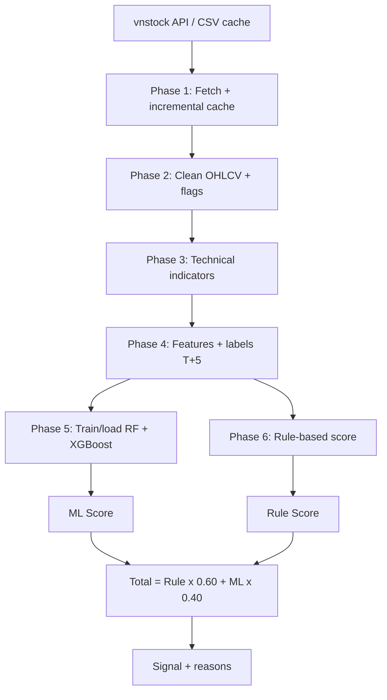

# DSS - He Thong Ho Tro Quyet Dinh Co Phieu VN30

DSS (Decision Support System) la pipeline phan tich co phieu ngan han, ket hop
chi bao ky thuat, luat chuyen gia va hai mo hinh Machine Learning:

- Random Forest.
- XGBoost.

He thong tao diem `0-100` cho tung ma, sau do phan loai thanh `MUA MANH`,
`MUA`, `GIU`, `BAN` hoac `BAN MANH`. DSS chi ho tro phan tich, khong tu dong
dat lenh va khong phai cam ket loi nhuan.

> **Trang thai hien tai:** pipeline lay du lieu, lam sach, tao feature, train/
> nap model, danh gia walk-forward va tao khuyen nghi dang co trong source.
> Backtest giao dich chua duoc trien khai: repository hien chua co
> `backtest_runner.py` va `src/backtest/backtester.py`.

## Muc luc

- [1. Tong quan](#1-tong-quan)
- [2. Cai dat va chay nhanh](#2-cai-dat-va-chay-nhanh)
- [3. Cac lenh](#3-cac-lenh)
- [4. Kien truc pipeline](#4-kien-truc-pipeline)
- [5. Du lieu va feature](#5-du-lieu-va-feature)
- [6. Huong dan train va danh gia](#6-huong-dan-train-va-danh-gia)
- [7. He thong diem](#7-he-thong-diem)
- [8. Cau truc du an](#8-cau-truc-du-an)
- [9. Tai lieu lien quan](#9-tai-lieu-lien-quan)
- [10. Gioi han](#10-gioi-han)

## 1. Tong quan

### Muc tieu

Voi moi ma co phieu, DSS:

1. Lay du lieu OHLCV lich su tu `vnstock`.
2. Luu cache theo CSV va cap nhat them nen moi khi co the.
3. Lam sach du lieu theo thu tu thoi gian.
4. Tinh chi bao ky thuat va tao feature tuong doi.
5. Gan nhan huan luyen cho loi nhuan sau 5 phien.
6. Train hoac nap cap model RF/XGBoost.
7. Ket hop diem Rule-based va ML thanh khuyen nghi.

### Pham vi

| Thanh phan | Gia tri hien tai |
|---|---|
| Thi truong | Co phieu trong ro VN30, co fallback 30 ma mac dinh |
| Tan suat du lieu | Nen ngay |
| Lich su mac dinh | 3 nam, toi da 750 dong API moi lan tai |
| Tam nhin nhan ML | 5 phien giao dich, T+5 |
| Bai toan ML | Phan loai 3 lop: SELL/HOLD/BUY |
| Feature production | 19 feature baseline |
| Mo hinh | Random Forest + XGBoost |
| Validation danh gia | Expanding walk-forward, khong shuffle, purge gap 5 phien |
| Ket qua dau ra | Diem Rule, diem ML, tong diem va tin hieu |

## 2. Cai dat va chay nhanh

### Yeu cau

- Python 3.10 tro len.
- Ket noi Internet khi fetch du lieu.
- Shell Bash tren macOS/Linux neu dung `run.sh`.

### Cai dat

```bash
./run.sh setup
```

Lenh nay tao `.venv` trong project, cai dependencies tu `requirements.txt` va
tao cac thu muc cache can thiet.

### Quy trinh chay de xuat

```bash
# 1. Dong bo du lieu VN30 va VNINDEX
./run.sh fetch

# 2. Chay khuyen nghi, uu tien model .pkl da co
./run.sh dss

# 3. Neu muon train lai model
./run.sh dss --retrain
```

Chay offline voi cache da co:

```bash
python main.py --no-fetch --symbols FPT,ACB
```

Neu chi muon dong bo du lieu roi dung:

```bash
python main.py --fetch-only
```

## 3. Cac lenh

| Lenh | Tac dung |
|---|---|
| `./run.sh setup` | Tao virtual environment, cai thu vien, tao thu muc |
| `./run.sh fetch` | Lay/cap nhat CSV VN30 va VNINDEX |
| `./run.sh dss` | Chay pipeline va in bang khuyen nghi |
| `./run.sh dss --retrain` | Bo qua model cache va train lai |
| `./run.sh test` | Smoke test offline voi toi da 2 ma |
| `./run.sh evaluate --symbols FPT,ACB` | Tao phan bo label, metrics va confusion matrix |
| `./run.sh tune --symbols FPT,ACB` | So sanh ba cau hinh RF/XGBoost bang walk-forward |
| `./run.sh status` | Kiem tra du lieu, model va source |
| `./run.sh clear-data` | Xoa CSV cache, giu lai model |
| `./run.sh clean` | Xoa data cache, model va `__pycache__` |
| `./run.sh help` | In danh sach lenh |

Danh gia cac bien the label/feature:

```bash
./run.sh evaluate --label-strategy fixed --feature-set baseline
./run.sh evaluate --label-strategy volatility --feature-set baseline
./run.sh evaluate --label-strategy triple_barrier --feature-set baseline
./run.sh evaluate --label-strategy fixed --feature-set extended
```

Ket qua duoc ghi vao:

```text
reports/<label_strategy>_<feature_set>/
├── label_distribution.csv
├── walk_forward_metrics.csv
└── confusion_matrix.csv
```

`reports/`, `data/` va `models/` dang duoc gitignore, vi vay day la artifact
cuc bo cua moi lan chay, khong phai du lieu dong goi san trong repository.

## 4. Kien truc pipeline



### Phase 1 - Fetch va cache

`src/data/data_fetcher.py`:

- Quet danh sach VN30 bang `Reference().equity.list_by_group("VN30")`.
- Neu API loi hoac tra ve duoi 20 ma, dung danh sach fallback.
- Tai co phieu bang `Market().equity(symbol).ohlcv(...)`.
- Tai VNINDEX bang `Market().index("VNINDEX").ohlcv(...)`.
- Dung toi da 3 worker dong thoi.
- Co retry loi mang, retry rieng khi luu va cho khi gap rate limit.
- Ma chua co CSV duoc tai full; ma da co chi lay nen sau ngay cuoi cung.
- `symbols.json` luu manifest cac ma da tung duoc dong bo.

### Phase 2 - Lam sach

`src/data/data_cleaner.py` yeu cau cot `time`, sap xep tang dan va chuyen
OHLC/volume ve dang so.

- Chi `forward-fill` cac cot OHLC. Khong `backward-fill` de tranh lay du lieu
  tuong lai dien vao qua khu.
- Volume bi thieu duoc gan co `volume_missing=True`, sau do dien `0`.
- `period_return` la thay doi gia dong cua so voi ky truoc.
- `is_extreme=True` neu bien dong tuyet doi tu `6.8%` tro len. Nguong nay chi
  danh cho nen ngay.
- `is_ohlc_invalid=True` neu high/low vi pham logic cua mot cay nen.
- Dong thieu `time` hoac `close` sau xu ly bi loai bo.

VNINDEX duoc chuan hoa thanh hai cot `time` va `indexValue`.

### Phase 3 - Chi bao ky thuat

`src/features/indicators.py` tao cac cot chi bao sau:

| Nhom | Chi bao |
|---|---|
| Trend | `sma_10`, `sma_20`, `sma_50`, `sma_200`, `ema_12`, `ema_26` |
| MACD | `macd`, `macd_signal`, `macd_hist` |
| Momentum | `rsi`, `stoch_k`, `stoch_d`, `williams_r` |
| Volatility | `bb_upper`, `bb_mid`, `bb_lower`, `bb_width`, `atr`, `atr_pct` |
| Volume | `obv`, `vol_sma_20`, `vol_ratio` |

Tong cong la 22 cot chi bao duoc them vao OHLCV. Ham yeu cau toi thieu 50
dong, nhung `sma_200` van tao NaN o cac dong dau; buoc train se loai cac dong
chua du feature.

### Phase 4 - Feature engineering va label

19 feature baseline trong `FEATURE_COLUMNS`:

```text
price_vs_sma50       price_vs_sma200       sma50_vs_sma200
macd_hist            macd_hist_slope
rsi                  stoch_k               stoch_d              williams_r
bb_position          bb_width              atr_pct
vol_ratio            obv_slope
return_1d            return_5d              return_20d
vnindex_vs_sma50     vnindex_return_5d
```

Feature extended them 8 cot, thanh 27 cot:

```text
return_3d, return_10d, return_60d, rsi_slope,
volume_zscore_20, vnindex_return_20d,
vnindex_volatility_20d, relative_strength_5d
```

Tat ca feature chi dung thong tin qua khu/hien tai. `future_return` chi dung
de tao label va khong duoc dua vao `FEATURE_COLUMNS`.

Ba chien luoc label:

| Strategy | Quy tac |
|---|---|
| `fixed` | BUY neu loi nhuan sau 5 phien >= `+3%`; SELL neu <= `-3%`; con lai HOLD |
| `volatility` | Nguong la `max(3%, 1.5 x ATR%)` tai thoi diem vao |
| `triple_barrier` | Xem gia cao/thap trong 5 phien; barrier nao cham truoc thi gan BUY/SELL |

Production mac dinh dung `fixed` voi mapping:

```text
-1 = SELL, 0 = HOLD, 1 = BUY
```

### Phase 5 - Train, nap model va du doan

`src/models/ml_models.py`:

- Loai cac dong thieu 19 feature hoac label.
- Neu duoi `MIN_TRAIN_ROWS=100` dong thi khong train va dung ML score trung
  tinh `50`.
- Chia theo thoi gian: 80% dau de train, 20% cuoi de test.
- Khong shuffle.
- Train mot RF va mot XGBoost cho tung ma.
- Luu tai `models/<SYMBOL>_rf.pkl` va `models/<SYMBOL>_xgb.pkl`.
- Lan chay binh thuong uu tien model cache; `--retrain` moi train lai.

Chi tiet tham so va cach danh gia xem
[ml_training_walkthrough.md](ml_training_walkthrough.md).

### Phase 6 - Cham diem va khuyen nghi

`src/scoring/scoring.py` cham Rule-based tu diem goc 50. Cac nhom dieu kien
gom trend, momentum, volume, volatility va VNINDEX. Diem sau cung bi gioi han
trong `[0, 100]`.

`src/scoring/decision.py` tinh:

```text
total_score = rule_score * 0.60 + ml_score * 0.40
```

Mapping tin hieu:

| Tong diem | Tin hieu |
|---:|---|
| `>= 75` | MUA MANH |
| `60 - <75` | MUA |
| `40 - <60` | GIU |
| `25 - <40` | BAN |
| `< 25` | BAN MANH |

Ket qua moi ma gom gia dong cua, Rule Score, ML Score, Total Score, signal va
toi da hai ly do Rule-based dau tien.

## 5. Du lieu va feature

### Cong thuc chinh

Vi tri gia:

```text
price_vs_sma50 = (close - SMA50) / |SMA50| x 100
price_vs_sma200 = (close - SMA200) / |SMA200| x 100
sma50_vs_sma200 = (SMA50 - SMA200) / |SMA200| x 100
```

Bollinger position:

```text
bb_position = (close - BB_lower) / (BB_upper - BB_lower)
```

Return qua khu:

```text
return_nd = close.pct_change(n) x 100
```

Nhãn fixed:

```text
future_return = close[t+5] / close[t] - 1
```

Nam dong cuoi khong co gia `t+5`, vi vay label la NaN va khong duoc dung de
train.

### Canh bao ve leakage

- Khong dung `future_return` lam feature.
- Khong `backward-fill` OHLC.
- Validation theo thu tu thoi gian.
- Walk-forward evaluation loai `gap=5` dong giua train va validation de label
  cua train khong chong lan cua vung validation.

## 6. Huong dan train va danh gia

### Train production

```bash
python main.py --no-fetch --symbols FPT,ACB --retrain
```

Day la single chronological holdout 80/20 va luu model vao `models/`.

### Danh gia walk-forward

```bash
./run.sh evaluate --symbols FPT,ACB
```

Quy trinh nay dung expanding window:

- Initial train: 50% so dong usable.
- Moi fold validation: 10%.
- Purge gap: 5 phien.
- Khong shuffle.
- Bao cao RF, XGB va Ensemble 50/50.

Metric can uu tien:

- `Balanced Accuracy`: trung binh recall cua cac lop.
- `Macro F1`: trung binh F1 cua SELL/HOLD/BUY, khong de HOLD ap dao che
  khuech dai ket qua.
- BUY/SELL precision va recall: do chat luong cua tin hieu hanh dong.
- `confusion_matrix.csv`: xem BUY/SELL bi day nham ve HOLD bao nhieu.

Doc nhanh chat luong:

| Chi so | Tot hon khi | Dau hieu xau |
|---|---|---|
| Accuracy | Cao hon baseline luon doan HOLD va van bat duoc BUY/SELL | Cao nhung BUY/SELL recall gan 0 |
| Balanced Accuracy | Tren `0,40` va on dinh qua cac fold | Gan `0,333` hoac thap hon |
| Macro F1 | Vuot ro baseline HOLD; `>0,40` la muc tham khao kha | Gan baseline hoac khong vuot baseline |
| BUY/SELL Precision | Tren `0,40` va khong doi lai bang recall qua thap | Duoi `0,25`, nhieu tin hieu nham |
| BUY/SELL Recall | Tren `0,40` ma precision van chap nhan duoc | Duoi `0,20`, bo sot hau het su kien |

Day chi la nguong tham khao, khong phai tieu chuan bao dam loi nhuan. Fixed
label hien co HOLD khoang `62,2%`, nen Accuracy co the bi danh lua. Xem phan
[dinh nghia metric va baseline](ml_training_walkthrough.md#81-dinh-nghia-va-cach-danh-gia-totxau)
de biet cach doc confusion matrix va Expected Value.

Snapshot report `reports/fixed_baseline/` hien co:

| Label | So dong |
|---|---:|
| SELL | 3.586 |
| HOLD | 13.211 |
| BUY | 4.449 |
| Tong | 21.246 |

Tren 29 ma co aggregate walk-forward metrics, trung binh theo ma cua
Ensemble 50/50 la:

| Metric | Gia tri |
|---|---:|
| Balanced Accuracy | 0,333 |
| Macro F1 | 0,318 |
| BUY Precision | 0,242 |
| BUY Recall | 0,267 |
| SELL Precision | 0,218 |
| SELL Recall | 0,168 |

Day la ket qua phan loai, khong phai loi nhuan giao dich. Khong duoc suy ra
rang DSS da vuot Buy & Hold khi chua co backtest hop le, phi giao dich va
slippage.

### Tune

```bash
./run.sh tune --symbols FPT,ACB
```

Lenh nay so sanh ba ung vien:

- `baseline`: cau hinh trong `config.py`.
- `regularized`: cay nong hon va leaf lon hon.
- `responsive`: cay sau hon va leaf nho hon.

Ket qua ghi vao `reports/tuning_results.csv`. Khong tu dong thay doi cau hinh
production.

## 7. He thong diem

### ML score

Model dung class id:

```text
class 0 = SELL
class 1 = HOLD
class 2 = BUY
```

RF va XGBoost cho xac suat tung lop. DSS lay trung binh xac suat cua hai
model, sau do hieu chinh theo prior that cua tap train vi ca hai model duoc
train voi class balancing. `ML Score` la xac suat BUY sau hieu chinh nhan 100.

Neu thieu cap model hoac dong du doan co feature NaN, ML score tra ve 50 de
Rule-based giu vai tro trung tinh thay vi tu dien mot gia tri tuy y.

### Rule score

Mot so dieu kien chinh:

| Nhom | Vi du diem cong/tru |
|---|---|
| Trend | Gia > SMA50 > SMA200: +10; downtrend: -8; death cross gan day: -10 |
| Momentum | RSI hoi phuc: +10; RSI >80: -12; Stochastic cat mua oversold: +8 |
| Volume | Volume >= 1,5 lan trung binh va gia tang: +10; ban thao: -10 |
| Volatility | Bat tu dai duoi BB: +8; cham dai tren: -5; ATR cao: -5 |
| VNINDEX | Tren SMA50: +5; duoi SMA50: -5; giam manh 5 phien: -5 |

Day la heuristic co dinh, khong phai trong so duoc hoc tu du lieu. Cac con so
tren la muc diem cua tung dieu kien trong code; diem thuc te co the cong don va
duoc clip ve `[0, 100]`.

## 8. Cau truc du an

```text
DSS/
├── config.py
├── main.py
├── run.sh
├── requirements.txt
├── src/
│   ├── data/
│   │   ├── data_fetcher.py
│   │   └── data_cleaner.py
│   ├── features/
│   │   ├── indicators.py
│   │   └── features.py
│   ├── models/
│   │   ├── ml_models.py
│   │   ├── metrics.py
│   │   ├── validation.py
│   │   ├── evaluate.py
│   │   └── tune.py
│   ├── scoring/
│   │   ├── scoring.py
│   │   └── decision.py
│   └── backtest/
│       └── __init__.py
├── data/       # CSV cache, gitignored, tao sau khi fetch
├── models/     # file .pkl, gitignored
└── reports/    # CSV danh gia, gitignored
```

## 9. Tai lieu lien quan

| Tai lieu | Noi dung |
|---|---|
| [ml_training_walkthrough.md](ml_training_walkthrough.md) | Tham so train, label, validation, metrics va ket qua hien tai |
| [dss_labels_reference.md](dss_labels_reference.md) | Tra cuu label va nguong diem; can doi chieu source neu co mau thuan |
| [dss_algorithm_analysis.md](dss_algorithm_analysis.md) | Giai thich RF, XGBoost, ensemble va han che |
| [implementation_plan.md](implementation_plan.md) | Y tuong kien truc 7 phase ban dau; mot so phase chua co source thuc thi |
| [DSS_FULL_CODE_GUIDE.md](DSS_FULL_CODE_GUIDE.md) | Snapshot minh hoa cu, khong phai source of truth |

Nguon chinh de doi chieu hanh vi la `config.py`, `main.py` va cac module trong
`src/`.

## 10. Gioi han

- Du lieu phu thuoc API va co the thay doi do dieu chinh lich su, loi mang hoac
  rate limit.
- VN30 la ro thay doi theo thoi gian; fallback la danh sach tinh.
- Nhan `fixed` co the tao mat can bang lop, voi HOLD thuong chiem da so.
- Ket qua phan loai hien tai con yeu va khong dong deu giua cac ma.
- Model chi hoc tu OHLCV va VNINDEX, khong co tin tuc, bao cao tai chinh hay
  yeu to vi mo.
- Chua co backtest giao dich day du voi phi, slippage, drawdown va Sharpe.
- Ket qua qua khu khong dam bao ket qua tuong lai.

Day la cong cu nghien cuu va ho tro ra quyet dinh. Nguoi dung tu chiu trach
nhiem voi quan tri von, stop-loss va quyet dinh giao dich cuoi cung.
