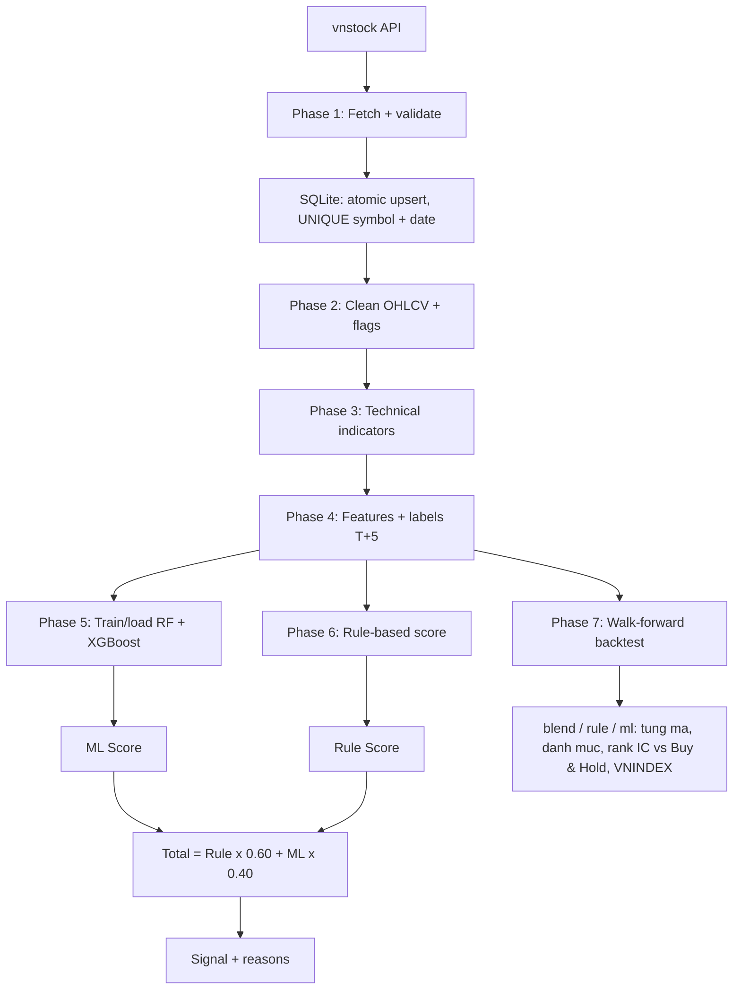

# DSS - He Thong Ho Tro Quyet Dinh Co Phieu VN30

DSS (Decision Support System) la pipeline phan tich co phieu ngan han, ket hop
chi bao ky thuat, luat chuyen gia va hai mo hinh Machine Learning:

- Random Forest.
- XGBoost.

He thong tao diem `0-100` cho tung ma, sau do phan loai thanh `MUA MANH`,
`MUA`, `GIU`, `BAN` hoac `BAN MANH`. DSS chi ho tro phan tich, khong tu dong
dat lenh va khong phai cam ket loi nhuan.

> **Trang thai hien tai:** pipeline lay du lieu, lam sach, tao feature, train/
> nap model, danh gia walk-forward, tao khuyen nghi va backtest giao dich
> (co phi/thue/slippage, T+2, thanh phan VN30 theo tung ky) deu da co trong
> source. Cau hinh khuyen nghi mac dinh **khong co loi the**; ML voi nhan vuot
> VNINDEX va tam nhin 20 phien co tin hieu xep hang that nhung chua on dinh de
> giao dich. Xem [ket qua hien tai](#ket-qua-hien-tai) truoc khi dung tin hieu.

## Muc luc

- [1. Tong quan](#1-tong-quan)
- [2. Cai dat va chay nhanh](#2-cai-dat-va-chay-nhanh)
- [3. Cac lenh](#3-cac-lenh)
- [4. Kien truc pipeline](#4-kien-truc-pipeline)
- [5. Du lieu va feature](#5-du-lieu-va-feature)
- [6. Huong dan train va danh gia](#6-huong-dan-train-va-danh-gia)
- [7. He thong diem](#7-he-thong-diem)
- [8. Cau truc du an](#8-cau-truc-du-an)
- [9. Tai lieu lien quan](#9-tai-lieu-lien-quan)
- [10. Gioi han](#10-gioi-han)

## 1. Tong quan

### Muc tieu

Voi moi ma co phieu, DSS:

1. Lay du lieu OHLCV lich su tu `vnstock`.
2. Kiem tra nen va luu vao SQLite theo lo nguyen tu; cap nhat them nen moi.
3. Lam sach du lieu theo thu tu thoi gian.
4. Tinh chi bao ky thuat va tao feature tuong doi.
5. Gan nhan huan luyen cho loi nhuan sau 5 phien.
6. Train hoac nap cap model RF/XGBoost.
7. Ket hop diem Rule-based va ML thanh khuyen nghi.

### Pham vi

| Thanh phan | Gia tri hien tai |
|---|---|
| Thi truong | Co phieu trong ro VN30, co fallback 30 ma mac dinh |
| Tan suat du lieu | Nen ngay |
| Lich su mac dinh | 8 nam (gioi han nen ngay cua vnstock ban mien phi) |
| Tam nhin nhan ML | 5 phien (T+5) cho production; evaluate/backtest doi duoc bang `--horizon` |
| Bai toan ML | Phan loai 3 lop: SELL/HOLD/BUY |
| Feature production | 19 feature baseline |
| Mo hinh | Random Forest + XGBoost, mac dinh moi ma mot cap (`ML_POOLED=False`) |
| Validation danh gia | Expanding walk-forward, khong shuffle, purge gap 5 phien |
| Backtest | Walk-forward 12 thang, retrain moi 20 phien, co phi/thue/slippage/T+2; so sanh diem blend/rule/ml, tung ma va danh muc |
| Ket qua dau ra | Diem Rule, diem ML, tong diem va tin hieu |

## 2. Cai dat va chay nhanh

### Yeu cau

- Python 3.10 tro len.
- Ket noi Internet khi fetch du lieu.
- Shell Bash tren macOS/Linux neu dung `run.sh`.

### Cai dat

```bash
./run.sh setup
```

Lenh nay tao `.venv` trong project, cai dependencies (da ghim version) tu
`backend/requirements.txt` va tao cac thu muc cache can thiet.

### Quy trinh chay de xuat

```bash
# 1. Dong bo du lieu VN30 va VNINDEX
./run.sh fetch

# 2. Chay khuyen nghi, uu tien model .pkl da co
./run.sh dss

# 3. Neu muon ep train lai model (binh thuong model tu train lai khi cu hon du lieu)
./run.sh dss --retrain
```

Lan fetch dau tien tai 8 nam cho 31 ma, mat khoang 4 phut vi goi Guest cua
vnstock gioi han 20 don vi quota/phut (moi lan tai ton 2 don vi).

Chay offline voi cache da co:

```bash
python backend/main.py --no-fetch --symbols FPT,ACB
```

Neu chi muon dong bo du lieu roi dung:

```bash
python backend/main.py --fetch-only
```

## 3. Cac lenh

| Lenh | Tac dung |
|---|---|
| `./run.sh setup` | Tao virtual environment, cai thu vien, tao thu muc |
| `./run.sh fetch` | Lay/cap nhat SQLite VN30 va VNINDEX |
| `./run.sh dss` | Chay pipeline va in bang khuyen nghi |
| `./run.sh dss --retrain` | Bo qua model cache va train lai |
| `./run.sh test` | Chay unit test |
| `./run.sh web` | Mo bang gia VN30, so sanh ma va hoi ML tai `http://127.0.0.1:8765/` |
| `./run.sh smoke` | Smoke test pipeline offline voi 2 ma |
| `./run.sh evaluate --symbols FPT,ACB` | Tao phan bo label, metrics va confusion matrix |
| `./run.sh tune --symbols FPT,ACB` | So sanh ba cau hinh RF/XGBoost bang walk-forward |
| `./run.sh backtest` | Backtest walk-forward VN30: blend/rule/ml, tung ma, danh muc, rank IC |
| `./run.sh backtest --pooled` | Nhu tren nhung dung mot model hoc chung du lieu moi ma |
| `python backend/main.py --fetch-only --with-history` | Tai them du lieu cac ma tung thuoc VN30 (cho `--universe history`) |
| `./run.sh evaluate --label-strategy excess --horizon 20` | Walk-forward voi nhan vuot VNINDEX, tam nhin 20 phien |
| `./run.sh status` | Kiem tra du lieu, model va source |
| `./run.sh clear-data` | Xoa SQLite va CSV cu, giu lai model |
| `./run.sh clean` | Xoa data cache, model va `__pycache__` |
| `./run.sh help` | In danh sach lenh |

Giao dien web la du an React + Vite trong `frontend/`, dung Lucide React cho bieu tuong
va Recharts cho do thi gia. `./run.sh web` tu cai npm dependencies (lan dau), build
giao dien, roi chay API FastAPI/Uvicorn tai `http://127.0.0.1:8765/`.
Khi phat trien giao dien, giu backend dang chay va dung `cd frontend && npm run dev`
de co hot reload tai localhost:5173 (Vite proxy `/api` ve backend).
Huong dan chay mot may Linux voi systemd, reverse proxy va health check nam tai
[`deploy/README.md`](deploy/README.md). CI tai `.github/workflows/ci.yml` chay
test backend, test/lint/format/build frontend tren moi push va pull request.
Code giao dien nam trong `frontend/src/features/` theo tung luong: `market/` (bang gia,
do thi, so sanh), `discovery/`, `research/`, `assistant/`. `frontend/src/common/api.js`
la noi duy nhat goi API. `backend/api/server.py` chi xu ly HTTP va static files;
`backend/api/features/market.py` giu snapshot, polling va route thi truong;
`backend/api/features/assistant.py` giu route hoi dap;
`backend/api/features/profit_loss.py` tinh loi/lo theo gia dong cua. `common/format.js` va
`Change.jsx` dung chung cho cac tinh nang. `App.jsx` ghep cac phan va giu ma dang chon.
Chay `cd frontend && npm test` de kiem tra hop dong API, `npm run lint` de bat loi
tham chieu/bien thua, `npm run format:check` de kiem tra dinh dang va
`npm run build` de tao ban phuc vu.

Sau `./run.sh fetch`, chay `./run.sh web`. Trong gio giao dich (9h–15h,
thu 2–6, gio Viet Nam), backend polling bang gia VN30 theo lo moi 20 giay;
frontend lay snapshot moi 20 giay. Gia trong phien, tham chieu va bien dong
lay tu bang gia vnstock, co thoi diem backend nhan gia; neu API loi hoac ngoai
gio giao dich, giao dien dung gia nen ngay da chot. Sau 15h backend dong bo
nen ngay va tinh lai snapshot/model khi du lieu moi co san, khong can khoi dong
lai. Khi mot ma chua co nen ngay moi, snapshot cu duoc giu lai va dong bo duoc
thu lai sau 15 phut. API tra `data_as_of`, `snapshot_generated_at`, `quote_as_of`,
`quote_status`, `model_id`, `model_version`, `model_spec` va `contract_version` de
frontend hien dung do moi va cau hinh diem. Gioi han do tre thuc te phu thuoc
nguon vnstock, khong phai tick stream.
Lan dau may chu huan luyen model chung `excess` T+20 tu lich su thanh phan VN30
va luu vao `backend/models/`; ML va do thi chi dung nen ngay da chot, khong train tren
gia trong phien. Chat ML
mo tu nut noi goc phai; no chi nhan cau hoi ve xep hang VN30, ma trong ro, so
sanh ma va phuong phap. Diem ML la diem xep hang tuong doi, khong phai xac suat
lai hay lenh mua.
Chon ma trong bang gia de mo cua so phan tich voi do thi, hang ML va cac ma co
diem cao hon. Co the dong cua so bang nut X, phim Escape hoac bam ben ngoai.
Trong cua so nay, nhap ngay mua, gia mua (nghin dong/CP) va so co phieu roi
bam "Tinh loi/lo". Frontend goi `POST /api/profit-loss`; backend tinh cho tung
phien trong 120 nen gan nhat. Loi/lo tam tinh = gia dong cua x so CP x 1.000
- chi phi ban gia dinh - (gia mua x so CP x 1.000 + chi phi mua). Chi phi mua
gom phi va truot gia; chi phi ban gom phi, thue va truot gia theo `backend/config.py`.
Bang hien thay doi so voi phien truoc, loi/lo tich luy, muc loi cao nhat va lo
lon nhat. Day la mo phong theo nen da dong, khong phai du bao tung phien tuong lai
hay so tien da thuc hien; chua tinh co tuc va quyen co phieu.

Cache va chia tai (mot may, filesystem dung chung):

```bash
./run.sh web-balanced
```

Lenh tren build React, tao `backend/data/web_snapshot_sqlite.json` mot lan, chay mot
producer cap nhat du lieu va hai ASGI worker cua Uvicorn tai cong 8765. Worker
chi doc snapshot, khong goi vnstock hoac train model. Snapshot
duoc ghi nguyen tu, tai su dung neu file du lieu khong doi; dung
`./run.sh web --build-only --rebuild` de ep tao lai.
Gia trong phien qua 60 giay khong duoc worker phuc vu. API GET dung ETag de
trinh duyet tai lai khi noi dung thay doi. `/health/live` va `/health/ready`
dung cho giam sat tien trinh. Log API la JSON theo dong.
Che do nay danh cho cac tien trinh tren cung mot may; neu chay tren nhieu may,
can thay snapshot file bang kho du lieu chia se va mot load balancer ben ngoai.

Popup ma cho thay ba tin hieu phan lop sau khi RF va XGBoost duoc lay trung binh
va hieu chinh theo ty le lop trong du lieu train. Diem ML = 50 + 0,5 x
(tin hieu vuot VNINDEX % - tin hieu kem VNINDEX %). Cac ty le nay giai thich
phep tinh diem, khong phai xac suat sinh loi hay muc dong gop cua tung feature.

Danh gia cac bien the label/feature:

```bash
./run.sh evaluate --label-strategy fixed --feature-set baseline
./run.sh evaluate --label-strategy volatility --feature-set baseline
./run.sh evaluate --label-strategy triple_barrier --feature-set baseline
./run.sh evaluate --label-strategy fixed --feature-set extended
```

Ket qua duoc ghi vao:

```text
backend/reports/<label_strategy>_<feature_set>/
├── label_distribution.csv
├── walk_forward_metrics.csv
└── confusion_matrix.csv
```

`backend/reports/`, `backend/data/` va `backend/models/` dang duoc gitignore, vi vay day la artifact
cuc bo cua moi lan chay, khong phai du lieu dong goi san trong repository.

## 4. Kien truc pipeline



### Phase 1 - Fetch va cache

`backend/src/data/data_fetcher.py`:

- Quet danh sach VN30 bang `Reference().equity.list_by_group("VN30")`.
- Neu API loi hoac tra ve duoi 20 ma, dung danh sach fallback.
- Tai co phieu bang `Market().equity(symbol).ohlcv(...)`.
- Tai VNINDEX bang `Market().index("VNINDEX").ohlcv(...)`.
- Moi lan goi API duoc gian cach `SECONDS_PER_CALL=7` giay (chung cho moi
  luong) de khong vuot quota; vnai goi `sys.exit` khi vuot quota nen loi nay
  duoc bat lai de cho va thu tiep.
- Ma chua co trong SQLite hoac lich su ngan hon 8 nam: tai full.
- Ma da co du lieu: tai chong `REFRESH_DAYS=10` ngay cuoi roi upsert theo
  `(symbol, time)`; nen chua chot khong duoc luu.
- Neu gia dong cua trung ngay giua kho va API lech > 0,5% (gia dieu chinh do
  co tuc/chia tach), tai full va thay ca chuoi trong transaction de khong tron
  hai co so gia.
- Khong bao gio luu nen cua hom nay truoc 15:00 (gio Viet Nam).
- vnstock chi duoc import khi thuc su goi API, kem
  `VNSTOCK_DISABLE_AGENT_SETUP=1` de thu vien khong tu ghi `AGENTS.md` vao
  project. Chay offline, train, backtest va test khong can vnstock.
- Lan chay dau nhap CSV cu vao `backend/data/market.sqlite3`. Nen sai OHLC duoc
  giu voi `valid=0` de doi chieu, khong dua vao model. CSV cu khong bi xoa.
- Model cache duoc train lai mot lan sau khi chuyen kho de khong dung model cu
  da hoc tren nến sai.
- Chi ghi VNINDEX, cac ma va danh sach ma hien tai sau khi tat ca nến moi nhat
  hop le; mot loi se rollback ca lo. Snapshot cu van duoc phuc vu neu dong bo
  hoac dung model that bai.

### Phase 2 - Lam sach

`backend/src/data/data_cleaner.py` yeu cau cot `time`, sap xep tang dan va chuyen
OHLC/volume ve dang so.

- Chi `forward-fill` cac cot OHLC. Khong `backward-fill` de tranh lay du lieu
  tuong lai dien vao qua khu.
- Volume bi thieu duoc gan co `volume_missing=True`, sau do dien `0`.
- `period_return` la thay doi gia dong cua so voi ky truoc.
- `is_extreme=True` neu bien dong tuyet doi tu `6.8%` tro len. Nguong nay chi
  danh cho nen ngay.
- `is_ohlc_invalid=True` neu high/low vi pham logic cua mot cay nen.
- Dong thieu `time` hoac `close` sau xu ly bi loai bo.

VNINDEX duoc chuan hoa thanh hai cot `time` va `indexValue`.

### Phase 3 - Chi bao ky thuat

`backend/src/features/indicators.py` tao cac cot chi bao sau:

| Nhom | Chi bao |
|---|---|
| Trend | `sma_10`, `sma_20`, `sma_50`, `sma_200`, `ema_12`, `ema_26` |
| MACD | `macd`, `macd_signal`, `macd_hist` |
| Momentum | `rsi`, `stoch_k`, `stoch_d`, `williams_r` |
| Volatility | `bb_upper`, `bb_mid`, `bb_lower`, `bb_width`, `atr`, `atr_pct` |
| Volume | `obv`, `vol_sma_20`, `vol_ratio` |

Tong cong la 22 cot chi bao duoc them vao OHLCV. Ham yeu cau toi thieu 50
dong, nhung `sma_200` van tao NaN o cac dong dau; buoc train se loai cac dong
chua du feature.

### Phase 4 - Feature engineering va label

19 feature baseline trong `FEATURE_COLUMNS`:

```text
price_vs_sma50       price_vs_sma200       sma50_vs_sma200
macd_hist            macd_hist_slope
rsi                  stoch_k               stoch_d              williams_r
bb_position          bb_width              atr_pct
vol_ratio            obv_slope
return_1d            return_5d              return_20d
vnindex_vs_sma50     vnindex_return_5d
```

Feature extended them 8 cot, thanh 27 cot:

```text
return_3d, return_10d, return_60d, rsi_slope,
volume_zscore_20, vnindex_return_20d,
vnindex_volatility_20d, relative_strength_5d
```

Tat ca feature chi dung thong tin qua khu/hien tai. `future_return` chi dung
de tao label va khong duoc dua vao `FEATURE_COLUMNS`.
`label_end` luu ngay ket thuc nhan sau N nen hop le cua co phieu. Nhan `excess`
lay VNINDEX tai dung ngay dau va ngay `label_end`; thieu mot trong hai gia thi
bo nhan, khong dien gia tuong lai. `label_end` khong phai feature.

Bon chien luoc label (tam nhin N mac dinh 5, doi bang `--horizon` o evaluate/backtest):

| Strategy | Quy tac |
|---|---|
| `fixed` | BUY neu loi nhuan gross sau 5 phien >= `3% + chi phi vong di-ve`; SELL doi xung; con lai HOLD |
| `volatility` | Nguong la `max(3%, 1.5 x ATR%) + chi phi vong di-ve` |
| `excess` | BUY neu loi nhuan sau N phien vuot VNINDEX cung ky it nhat `3% + chi phi vong di-ve`; SELL doi xung |
| `triple_barrier` | Xem high/low trong N phien voi barrier da cong chi phi; barrier nao cham truoc thi gan BUY/SELL |

Production mac dinh dung `fixed` voi mapping:

```text
-1 = SELL, 0 = HOLD, 1 = BUY
```

### Phase 5 - Train, nap model va du doan

`backend/src/models/ml_models.py`:

- Loai cac dong thieu 19 feature hoac label.
- Neu duoi `MIN_TRAIN_ROWS=100` dong thi khong train va dung ML score trung
  tinh `50` (bang ket qua hien `–` o cot ML).
- Model production train tren **toan bo** dong co label de dung ca giai doan
  gan nhat. Metric holdout 20% cuoi (co purge 5 phien) chi in ra de tham khao.
- Khong shuffle.
- Mac dinh train mot RF va mot XGBoost cho tung ma; `--pooled` (hoac
  `ML_POOLED=True`) train mot cap chung cho moi ma.
- Luu ca cap RF/XGB nguyen tu tai `backend/models/<SYMBOL>_bundle.pkl` (hoac
  `backend/models/POOLED_bundle.pkl`), kem prior, feature schema, nhan/tam nhin,
  tham so, version thu vien va ngay cuoi du lieu. File RF/XGB cu duoc xoa sau
  lan train va ghi bundle thanh cong.
- Model cache tu train lai khi thieu metadata, khac feature schema hoac cu hon
  du lieu qua `MODEL_MAX_AGE_DAYS=7` ngay; `--retrain` ep train lai.

Chi tiet tham so va cach danh gia xem
[ML_HANDOVER_GUIDE.md](ML_HANDOVER_GUIDE.md).

### Phase 6 - Cham diem va khuyen nghi

`backend/src/scoring/scoring.py` cham Rule-based tu diem goc 50. Cac nhom dieu kien
gom trend, momentum, volume, volatility va VNINDEX. Diem sau cung bi gioi han
trong `[0, 100]`.

`backend/src/scoring/decision.py` tinh:

```text
total_score = rule_score * 0.60 + ml_score * 0.40
```

Mapping tin hieu:

| Tong diem | Tin hieu |
|---:|---|
| `>= 75` | MUA MANH |
| `60 - <75` | MUA |
| `40 - <60` | GIU |
| `25 - <40` | BAN |
| `< 25` | BAN MANH |

Ket qua moi ma gom gia dong cua, Rule Score, ML Score, Total Score, signal va
toi da hai ly do Rule-based dau tien. Dau bang ghi ngay cua nen dung de cham
diem; ma nao co du lieu cu hon duoc ghi chu rieng.

## 5. Du lieu va feature

### Cong thuc chinh

Vi tri gia:

```text
price_vs_sma50 = (close - SMA50) / |SMA50| x 100
price_vs_sma200 = (close - SMA200) / |SMA200| x 100
sma50_vs_sma200 = (SMA50 - SMA200) / |SMA200| x 100
```

Bollinger position:

```text
bb_position = (close - BB_lower) / (BB_upper - BB_lower)
```

Return qua khu:

```text
return_nd = close.pct_change(n) x 100
```

Nhãn fixed:

```text
future_return = close[t+5] / close[t] - 1
```

Label BUY/SELL chi duoc gan khi bien dong vuot `ML_PROFIT_THRESHOLD` cong chi
phi giao dich vong di-ve. Mac dinh chi phi nay la `0,6%` theo phi, thue va
slippage trong `backend/config.py`, de label khong coi mot giao dich gross +3% la
thang neu loi nhuan rong sau chi phi khong dat muc tieu.

Nam dong cuoi khong co gia `t+5`, vi vay label la NaN va khong duoc dung de
train.

### Canh bao ve leakage

- Khong dung `future_return` lam feature.
- Khong `backward-fill` OHLC.
- Validation theo thu tu thoi gian.
- Walk-forward evaluation loai `gap=5` dong giua train va validation de label
  cua train khong chong lan cua vung validation.

## 6. Huong dan train va danh gia

### Train production

```bash
python backend/main.py --no-fetch --symbols FPT,ACB --retrain
```

Lenh nay train tren toan bo du lieu co label, in metric holdout 20% cuoi de
tham khao va luu model vao `backend/models/`.

### Danh gia walk-forward

```bash
./run.sh evaluate --symbols FPT,ACB
```

Quy trinh nay dung expanding window:

- Initial train: 50% so ngay usable (toi thieu 100 ngay).
- Moi fold validation: 10% so ngay; fold cuoi lay ca phan du.
- Purge gap: 5 phien.
- Cac ma cung ngay nam cung fold; loai them dong co `label_end` cham validation.
- Khong shuffle.
- Bao cao RF, XGB va Ensemble 50/50.
- Bao cao them `BaselineHold` (luon doan HOLD) va `BaselineMomentum` (dung
  `return_5d` de doan BUY/SELL), cung tren tung fold va aggregate.

Walk-forward do do dung cua nhan (argmax). Diem DSS that su dung (tong diem
60/40 va nguong 60) duoc do bang backtest ben duoi.

Metric can uu tien:

- `Balanced Accuracy`: trung binh recall cua cac lop.
- `Macro F1`: trung binh F1 cua SELL/HOLD/BUY, khong de HOLD ap dao che
  khuech dai ket qua.
- BUY/SELL precision va recall: do chat luong cua tin hieu hanh dong.
- `confusion_matrix.csv`: xem BUY/SELL bi day nham ve HOLD bao nhieu.

Doc nhanh chat luong:

| Chi so | Tot hon khi | Dau hieu xau |
|---|---|---|
| Accuracy | Cao hon baseline luon doan HOLD va van bat duoc BUY/SELL | Cao nhung BUY/SELL recall gan 0 |
| Balanced Accuracy | Tren `0,40` va on dinh qua cac fold | Gan `0,333` hoac thap hon |
| Macro F1 | Vuot ro baseline HOLD; `>0,40` la muc tham khao kha | Gan baseline hoac khong vuot baseline |
| BUY/SELL Precision | Tren `0,40` va khong doi lai bang recall qua thap | Duoi `0,25`, nhieu tin hieu nham |
| BUY/SELL Recall | Tren `0,40` ma precision van chap nhan duoc | Duoi `0,20`, bo sot hau het su kien |

Day chi la nguong tham khao, khong phai tieu chuan bao dam loi nhuan. HOLD
chiem da so nhan fixed, nen Accuracy co the bi danh lua. Xem
[REPORT_METRICS.md](REPORT_METRICS.md) de biet cach doc confusion matrix.

Snapshot walk-forward cu, truoc khi sua lich nhan va fold cuoi (du lieu 8 nam,
29 ma; trung binh theo ma cua dong `aggregate`). Khong dung bang nay de ket luan
ve code hien tai; doi chung moi duoc ghi rieng trong [WEIGHTING_EXPERIMENT.md](WEIGHTING_EXPERIMENT.md).

| Cau hinh | Model | Balanced Acc | Macro F1 | BUY P / R | SELL P / R |
|---|---|---:|---:|---:|---:|
| `fixed` + baseline | Ensemble50 | 0,339 | 0,334 | 0,169 / 0,138 | 0,123 / 0,129 |
| | RF | 0,357 | 0,336 | 0,178 / 0,216 | 0,127 / 0,259 |
| | BaselineMomentum | 0,356 | 0,282 | 0,190 / 0,432 | 0,126 / 0,356 |
| `fixed` + extended | Ensemble50 | 0,351 | 0,346 | 0,206 / 0,141 | 0,130 / 0,124 |
| `volatility` + baseline | Ensemble50 | 0,334 | 0,327 | 0,112 / 0,094 | 0,076 / 0,085 |
| `triple_barrier` + baseline | Ensemble50 | 0,375 | 0,364 | 0,315 / 0,344 | 0,270 / 0,330 |
| | RF | 0,407 | 0,392 | 0,335 / 0,280 | 0,289 / 0,313 |
| | BaselineMomentum | 0,365 | 0,348 | 0,333 / 0,429 | 0,252 / 0,365 |

Phan bo nhan `fixed`: SELL 15,1%, HOLD 66,0%, BUY 19,0% (55.596 dong).
`BaselineHold` dat accuracy 0,710 nhung balanced accuracy chi 0,333.

Doc nhanh:

- Voi nhan `fixed` (production), Ensemble chi nhinh muc ngau nhien 0,333 va
  **khong vuot `BaselineMomentum`** ve balanced accuracy; BUY precision ~0,17.
- `extended` nhinh hon `baseline` mot chut tren moi metric.
- `triple_barrier` la cau hinh duy nhat ma RF vuot ro ca hai baseline
  (balanced accuracy 0,407 so voi 0,365). Tuy vay backtest voi luat thoat theo
  barrier van lo (xem ket qua ben duoi): phan loai dung hon khong dong nghia
  giao dich co lai sau chi phi.

Day la ket qua phan loai, khong phai loi nhuan giao dich. Xem phan
[ket qua hien tai](#ket-qua-hien-tai) ben duoi de biet ket qua sau chi phi.

### Backtest walk-forward

```bash
./run.sh backtest                     # model moi ma, 12 thang, nhan fixed, T+5
./run.sh backtest --pooled            # model chung moi ma
./run.sh backtest --symbols FPT,HPG --months 6

# Cac bien the nghien cuu
./run.sh backtest --pooled --horizon 20 --label-strategy excess
./run.sh backtest --pooled --label-strategy triple_barrier --exit barrier
./run.sh backtest --pooled --universe history --months 72 --retrain-every 60
```

| Tuy chon | Y nghia |
|---|---|
| `--horizon N` | Tam nhin cua nhan va so phien nam giu toi da (mac dinh 5) |
| `--label-strategy` | Nhan de train model trong backtest: `fixed`, `volatility`, `excess`, `triple_barrier` |
| `--exit barrier` | Them chot loi/cat lo trong phien khi gia cham `±(3% + 0,6%)` quanh gia vao (cham ca hai thi gia dinh cat lo truoc; chi tu phien T+3) |
| `--universe history` | Dung thanh phan VN30 theo tung ky thay vi ro hien tai (xem ben duoi) |

Quy trinh trong `backend/src/backtest/backtester.py`:

- Cham diem Rule/ML/Total cho moi ma, tung phien trong 12 thang cuoi (mac
  dinh). Model retrain moi 20 phien, chi hoc tu dong co label da biet.
- Tu cung bang diem, so sanh 3 nguon diem: `blend` (Rule 60% + ML 40%),
  `rule`, `ml`.
- **Tung ma:** moi ma giao dich rieng voi toan bo von.
- **Danh muc:** von chung chia 5 slot, moi phien lap slot trong bang cac ma
  diem cao nhat (>= 60).
- **Rank IC:** tuong quan hang theo ngay giua diem va loi nhuan T+5 thuc te.
- Tin hieu tai close ngay i, khop lenh tai open ngay i+1. Vao lenh khi diem
  `>= 60`, thoat tai close khi du T+5, hoac ban tai open khi diem `< 25` (chi
  tu phien T+3 vi thanh toan T+2).
- Tru phi moi gioi `0,15%/chieu`, thue ban `0,1%` va slippage `0,1%/chieu`
  (tong `0,6%` moi vong mua-ban).

Ket qua ghi vao
`backend/reports/backtest_<pooled|per_symbol>_<nhan>_h<N>_<exit>_<universe>_<thang>m/`, gom
tong hop, Rank IC va loi nhuan danh muc theo tung nam, tung ma, tung lenh va
bang diem (xem [REPORT_METRICS.md](REPORT_METRICS.md)).

#### Thanh phan VN30 theo tung ky

`backend/reference/vn30_changes.csv` ghi ro VN30 ngay 03/08/2020 va moi lan them/loai ma
den 03/08/2026 (13 ky xet duyet va 1 lan thay the bat thuong DGC → BSR), moi dong
kem link bai cong bo. Ro goc 2020 duoc suy nguoc tu ro hien tai; unit test kiem
tra moi ky deu du 30 ma va di xuoi het cac thay doi thi ra dung ro hien tai.

Voi `--universe history`:

- Chi vao lenh, xep hang (Rank IC) va train model tren cac ma thuoc ro **tai
  ngay do**; ma da roi ro van duoc giu den khi thoat lenh.
- Benchmark "nam deu cac ma trong ro" tai can bang moi ngay theo ro cua ngay do.
- Truoc 03/08/2020 dung ro goc (xap xi).
- Can tai du lieu cac ma tung thuoc ro: `python backend/main.py --fetch-only --with-history`.
  ROS (FLC Faros) da huy niem yet, chi con 34 phien nam 2022, nen giai doan
  08/2020–01/2021 ro chi co 29 ma co du lieu.

Khi HOSE cong bo ky xet duyet moi (thang 1, thang 7) hoac thay the bat thuong,
them dong vao file nay; test se bao loi neu ro khong con du 30 ma.

### Doi chung trong so tren du lieu da lam sach (22/09/2026)

Da sua nhan excess de so sanh dung cung ngay ket thuc, purge theo `label_end`,
va walk-forward danh gia ca fold cuoi. Doi chung pooled excess T+20, VN30 theo
lich su, 25/08/2020–17/09/2026, retrain 60 phien, 5 slot va cung phi/luat giao
dich; RF/XGB nhan cung trong so mau. Decay co chu ky giam mot nua 2 nam.

| Balancing | Decay | BUY precision / recall tai diem >=60 | Rank IC | Loi nhuan rong ca ky | Max drawdown |
|---|---|---:|---:|---:|---:|
| Co | Khong | 36,54% / 10,82% | +0,0701 | +109,66% | -49,77% |
| Khong | Khong | 36,77% / 10,67% | **+0,0733** | +205,25% | -49,59% |
| Co | 2 nam | 36,06% / 11,16% | +0,0659 | +170,81% | -42,93% |
| Khong | 2 nam | 36,95% / 11,32% | +0,0640 | **+233,09%** | **-41,47%** |

Benchmark equal-weight khong phi +139,92%, VNINDEX +108,53%. Ket hop khong
balancing voi decay dan dau loi nhuan/rui ro toan ky, nhung rieng 2024–09/2026 khong decay
lai cao hon (+102,66% so voi +84,83%). Day la doi chung tren lich su da xem,
chua phai holdout moi va chua doi mac dinh website. BUY precision do dung nhan
vuot VNINDEX, khong phai ty le giao dich co lai.

Chay lai: `python3 backend/weighting_experiment.py`. Ket qua, bang tung nam,
metric phan lop va gioi han: [WEIGHTING_EXPERIMENT.md](WEIGHTING_EXPERIMENT.md).
51 unit test dat; evaluate excess T+20 FPT/ACB co 5 fold moi ma den mau co
nhan cuoi 17/08/2026. Artifact rieng trong
`backend/reports/weighting_ablation_20260922/`.

### Ket qua tham chieu truoc chuyen doi

**Luu y:** bang ket qua ben duoi duoc tinh truoc khi chuyen sang SQLite va loai
nen OHLC sai; chi giu lam moc tham chieu, khong phai metric cua du lieu hien tai.
Chay lai lenh backtest ben duoi de co ket qua moi. Giao dien an metric nghien cuu
cu cho den khi bao cao duoc tao lai sau lan cap nhat du lieu.

Kiem tra truoc khi sua fold cuoi tren FPT/ACB: walk-forward `fixed` co 4 fold moi ma;
backtest pooled `fixed` T+5 trong 6 thang (18/03–17/09/2026) cho danh muc
`rule` -2,05%, `blend` -3,44%, `ml` +0,13% (Rank IC `ml` +0,008).
Day la kiem tra luong du lieu hai ma, khong thay the bao cao VN30 72 thang.

Nghien cuu chinh: model chung (`--pooled`), thanh phan VN30 theo tung ky
(`--universe history`), 72 thang (25/08/2020 → 17/09/2026), retrain moi 60
phien, danh muc 5 slot, da tru phi/thue/slippage. Cung ky: nam deu cac ma trong
ro **+139,9%**, VNINDEX **+108,5%**.

```bash
./run.sh backtest --pooled --universe history --months 72 --retrain-every 60 \
    --label-strategy excess --horizon 20
```

Danh muc theo nguon diem (Rank IC trung binh; so nam IC > 0 tren 7 nam):

| Nhan | Tam nhin | Thoat | `rule` | `blend` | `ml` |
|---|---:|---|---:|---:|---:|
| fixed | 5 | T+N | -69,6% (IC -0,003; 3/7) | -69,0% (+0,001; 5/7) | -59,9% (+0,024; 5/7) |
| fixed | 10 | T+N | -35,0% (-0,004; 3/7) | -47,3% (+0,004; 5/7) | -26,7% (+0,045; 6/7) |
| fixed | 20 | T+N | +17,8% (-0,001; 4/7) | +91,8% (+0,019; 6/7) | +79,8% (+0,054; 6/7) |
| excess | 5 | T+N | -69,6% (-0,003; 3/7) | -62,8% (+0,003; 4/7) | -5,7% (+0,045; 7/7) |
| excess | 10 | T+N | -35,0% (-0,004; 3/7) | -27,5% (+0,009; 5/7) | +79,1% (+0,058; 7/7) |
| excess | 20 | T+N | +17,8% (-0,001; 4/7) | +117,5% (+0,028; 6/7) | **+257,9%** (+0,069; 7/7) |
| triple_barrier | 5 | barrier | -76,6% (-0,003; 3/7) | -74,1% (+0,011; 5/7) | -62,3% (+0,044; 7/7) |
| triple_barrier | 10 | barrier | -70,7% (-0,004; 3/7) | -52,0% (+0,014; 5/7) | -22,3% (+0,052; 6/7) |

Cot `rule` giong nhau giua `fixed` va `excess` vi diem luat khong phu thuoc nhan.
Cau hinh tot nhat (`excess`, T+20, `ml`): 260 lenh, ty le thang 57,7%, lai rong
trung binh +2,86%/lenh, Sharpe 1,03, max drawdown -36,4%, von nam trong co phieu
68% thoi gian.

**Survivorship bias do duoc:** cung cau hinh `fixed`, T+5, neu dung ro hien tai
cho moi ngay (`--universe current`) thi "nam deu ro" thanh +256,1% thay vi
+139,9%, va danh muc `ml` lo -26,1% thay vi -59,9%. Ket qua cu dung ro hien tai
dep hon thuc te rat nhieu.

**Kiem tra thien lech chon cau hinh:** co 27 bien the (9 cau hinh x 3 nguon
diem), nen cau hinh dung dau de dep hon thuc te. Chon theo Rank IC chi dung
2020–2023 thi van ra `excess`, T+20, `ml` (IC 0,091). Tren 2024–09/2026:

| | Rank IC | Loi nhuan |
|---|---:|---:|
| `excess`, T+20, `ml` | +0,068 | +52,7% |
| Nam deu cac ma trong ro | | +63,2% |
| VNINDEX | | +61,1% |

Ket luan:

- **Diem luat khong co kha nang du bao:** Rank IC ~0 o moi cau hinh va chi
  duong 3–4/7 nam. Tron 60% diem luat vao lam `blend` kem hon `ml` o 7/8 cau hinh.
- **ML co tin hieu xep hang that nhung yeu:** Rank IC duong o hau het cac nam
  voi moi nhan, tot nhat voi nhan `excess` va tam nhin dai (IC tang tu 0,045 o
  T+5 len 0,069 o T+20), va van giu duoc sau khi chon cau hinh tren 2020–2023.
- **Tam nhin 5 phien lo o moi cau hinh:** chi phi 0,6% moi vong mua-ban an het
  phan loi cua tin hieu. Tam nhin 20 phien la cau hinh duy nhat co lai.
- **Barrier exit khong giup:** `triple_barrier` + thoat theo barrier kem hon
  thoat khi het tam nhin cung tam nhin.
- **Chua du de giao dich that:** danh muc tot nhat thang "nam deu ro" trong
  2020, 2021, 2022 va 2025 nhung thua trong 2023, 2024 va 2026; tinh chung
  2024–09/2026 van thua benchmark, va co drawdown -36%. Tin hieu xep hang on dinh, con luat giao dich (nguong 60, 5 slot,
  giu 20 phien) chua chuyen no thanh loi nhuan vuot thi truong mot cach on dinh.
- Cac cau hinh production (`backend/main.py`: nhan `fixed`, T+5, `blend` 60/40, model
  moi ma) **chua duoc doi**; theo ket qua tren, day la nhom cau hinh kem nhat.

### Tune

```bash
./run.sh tune --symbols FPT,ACB
```

Lenh nay so sanh ba ung vien:

- `baseline`: cau hinh trong `backend/config.py`.
- `regularized`: cay nong hon va leaf lon hon.
- `responsive`: cay sau hon va leaf nho hon.

Ket qua ghi vao `backend/reports/tuning_results.csv`. Khong tu dong thay doi cau hinh
production.

## 7. He thong diem

### ML score

Model dung class id:

```text
class 0 = SELL
class 1 = HOLD
class 2 = BUY
```

RF va XGBoost cho xac suat tung lop. DSS lay trung binh xac suat cua hai
model, sau do hieu chinh theo prior that cua tap train vi ca hai model duoc
train voi class balancing. ML Score dua ve cung thang voi Rule Score:

```text
ML Score = 50 + 50 x (P(BUY) - P(SELL))
```

`50` la trung tinh, `100` la chac chan BUY, `0` la chac chan SELL. Truoc day
ML Score la `P(BUY) x 100`; vi BUY chi chiem khoang 20% nhan nen diem nay co
trung vi khoang 14 va keo tong diem xuong nhu mot la phieu phu quyet.

Neu thieu cap model hoac dong du doan co feature NaN, ML score tra ve 50 de
Rule-based giu vai tro trung tinh thay vi tu dien mot gia tri tuy y.

### Rule score

Mot so dieu kien chinh:

| Nhom | Vi du diem cong/tru |
|---|---|
| Trend | Gia > SMA50 > SMA200: +10; chi gia > SMA50: +5 (khong cong don voi uptrend); downtrend: -8; death cross gan day: -10 |
| Momentum | RSI hoi phuc: +10; RSI >80: -12; Stochastic cat mua oversold: +8 |
| Volume | Volume >= 1,5 lan trung binh va gia tang: +10; ban thao: -10 |
| Volatility | Bat tu dai duoi BB: +8; cham dai tren: -5; ATR cao: -5 |
| VNINDEX | Tren SMA50: +5; duoi SMA50: -5 (thieu du lieu VNINDEX thi khong tru); giam manh 5 phien: -5 |

Day la heuristic co dinh, khong phai trong so duoc hoc tu du lieu. Gia tri
cua no chi duoc do qua backtest nguon diem `rule`. Cac con so
tren la muc diem cua tung dieu kien trong code; diem thuc te co the cong don va
duoc clip ve `[0, 100]`.

## 8. Cau truc du an

```text
DSS/
├── AGENTS.md
├── run.sh
├── backend/
│   ├── config.py
│   ├── main.py
│   ├── backtest_runner.py
│   ├── requirements.txt
│   ├── src/                  # data -> features -> models -> scoring/backtest
│   ├── api/                  # ASGI routes, snapshot, polling
│   ├── reference/            # lich su thanh phan VN30
│   ├── tests/                # ./run.sh test
│   ├── data/                 # SQLite va CSV cu nhap mot lan, gitignored
│   ├── models/               # model cache, gitignored
│   └── reports/              # ket qua danh gia, gitignored
└── frontend/
    ├── src/                  # React features va API client
    ├── tests/
    ├── package.json
    └── vite.config.js
```

## 9. Tai lieu lien quan

| Tai lieu | Noi dung |
|---|---|
| [ML_HANDOVER_GUIDE.md](ML_HANDOVER_GUIDE.md) | Tai lieu ban giao toan bo quy trinh ML, label, validation, model va backtest |
| [REPORT_METRICS.md](REPORT_METRICS.md) | Giai thich cac cot trong label, walk-forward, confusion matrix, tuning va backtest report |
| [dss_algorithm_analysis.md](dss_algorithm_analysis.md) | Ly thuyet cay quyet dinh, RF, XGBoost, ensemble, walk-forward va han che |
| [AGENTS.md](AGENTS.md) | Lenh, cau truc va quy tac khong duoc pha khi sua code |

Nguon chinh de doi chieu hanh vi la `backend/config.py`, `backend/main.py` va cac module trong
`backend/src/`.

## 10. Gioi han

- Du lieu phu thuoc API va co the thay doi do dieu chinh lich su, loi mang hoac
  rate limit.
- VN30 la ro thay doi theo thoi gian; fallback la danh sach tinh.
- **Survivorship bias:** mac dinh (`--universe current`), train, danh gia va
  backtest dung ro VN30 hien tai cho ca 8 nam nen ket qua co xu huong dep hon
  thuc te. `--universe history` sua dieu nay tu 08/2020; truoc do van la xap xi,
  va `evaluate`, `backend/main.py` van dung ro hien tai.
- Mot so ma moi niem yet (TCX, VPL) co lich su ngan, gan nhu khong co ML.
- Nhan `fixed` co the tao mat can bang lop, voi HOLD thuong chiem da so.
- Ket qua phan loai hien tai con yeu va khong dong deu giua cac ma.
- Model chi hoc tu OHLCV va VNINDEX, khong co tin tuc, bao cao tai chinh hay
  yeu to vi mo.
- Backtest dai nhat chi 6 nam (08/2020–09/2026) va co nhieu bien the duoc thu;
  ket qua phu thuoc manh vao giai doan thi truong (2020–2021, 2025). Trong so
  60/40, nguong 60/25 va so slot chua duoc toi uu (co y tranh overfit).
- Ket qua qua khu khong dam bao ket qua tuong lai.

Day la cong cu nghien cuu va ho tro ra quyet dinh. Nguoi dung tu chiu trach
nhiem voi quan tri von, stop-loss va quyet dinh giao dich cuoi cung.
