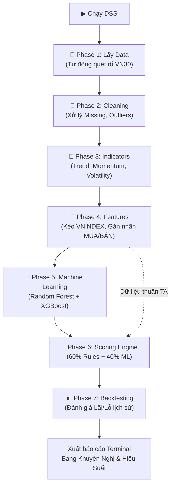
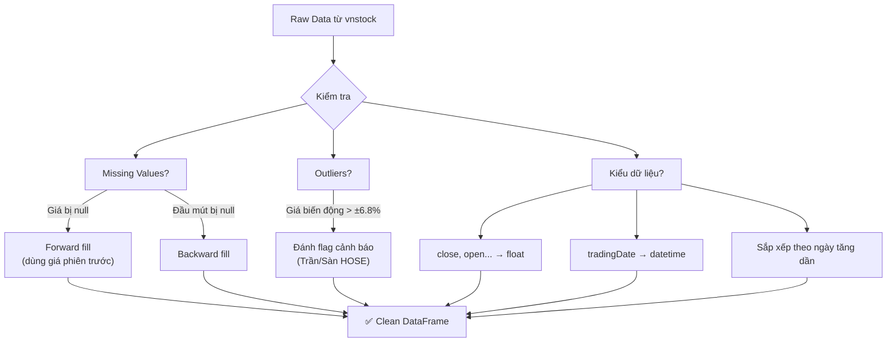
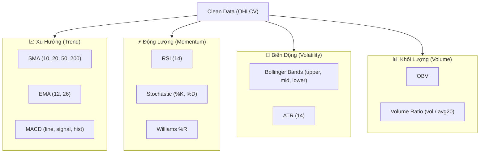
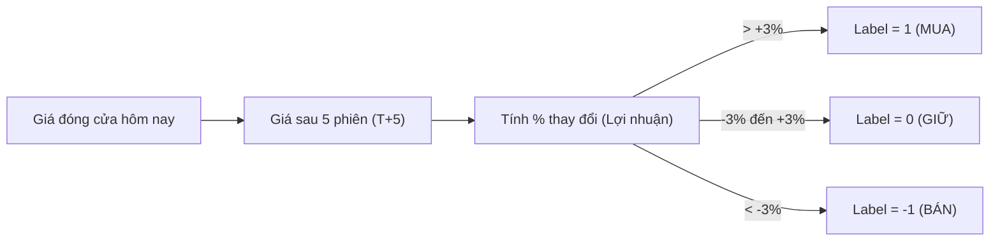
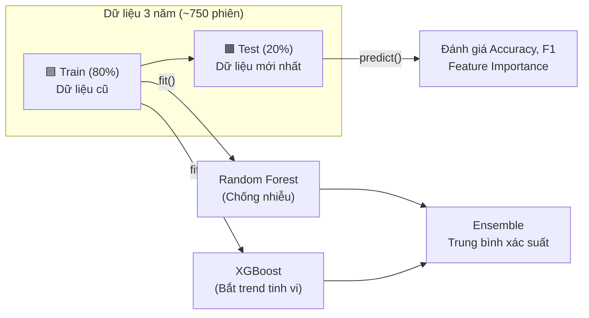
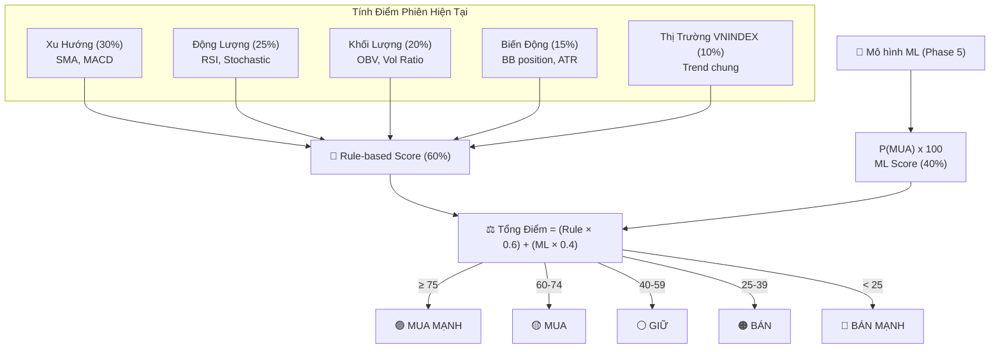

# DSS Mua Bán Cổ Phiếu — Implementation Plan (Scope VN30)

Chia thành **7 phase nhỏ**, mỗi phase có deliverable rõ ràng, chạy được độc lập. 
**Giới hạn (Scope):** Tự động lấy **VN30** (`vnstock`), Giao dịch **Ngắn hạn (T+5)**, Tích hợp **Backtest**.

---

## 1. Kiến Trúc Tổng Quan Toàn Hệ Thống

---

## 2. Chi tiết luồng xử lý từng Phase

### Phase 2: Data Cleaning (Làm sạch dữ liệu)

### Phase 3: Technical Indicators (Tính chỉ báo)

### Phase 4: Feature Engineering & Labeling (Gán nhãn T+5)

### Phase 5: Machine Learning (Huấn luyện & Walk-Forward)

### Phase 6: Scoring Engine (Bộ Não Ra Quyết Định)

---

## 3. Tổng hợp Files & Deliverables

| Phase | File thực thi | Chức năng chính |
|-------|---------------|-----------------|
| **Phase 1** | `src/data_fetcher.py` | Quét tự động danh sách VN30 mới nhất, gọi API vnstock. |
| **Phase 2** | `src/data_cleaner.py` | Lọc nhiễu, điền missing values, flag outlier trần/sàn. |
| **Phase 3** | `src/indicators.py` | Chạy thư viện `ta` tính toán ~25 cột chỉ báo. |
| **Phase 4** | `src/features.py` | Chuyển đổi thành giá trị tương đối, merge VNINDEX, gán nhãn T+5. |
| **Phase 5** | `src/ml_models.py` | Train Random Forest & XGBoost, lưu 60 model file (30 mã x 2). |
| **Phase 6** | `src/scoring.py`, `src/decision.py` | Cân quyền trọng số 60/40, in bảng màu Terminal. |
| **Phase 7** | `src/backtester.py`, `backtest_runner.py` | Giả lập giao dịch 6 tháng, so sánh PnL với Buy & Hold. |
| **Main** | `config.py`, `main.py` | Tùy chỉnh tham số và điểm neo chạy toàn bộ dự án. |

---

## User Review Required

> [!IMPORTANT]
> Toàn bộ các sơ đồ trực quan (Kiến trúc, Cleaning, Cấu trúc Chỉ báo, Labeling, ML Walk-forward, Scoring) đã được phục hồi đầy đủ. Bạn xác nhận plan này đã trực quan và chuẩn xác để đưa vào báo cáo đồ án chưa?
